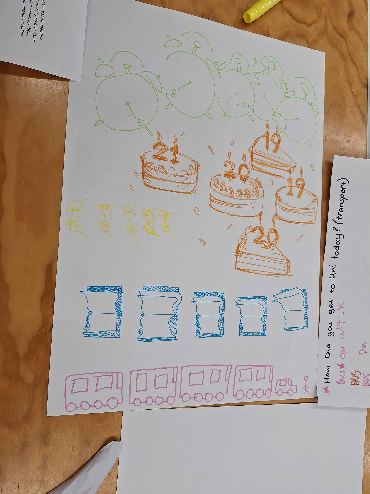
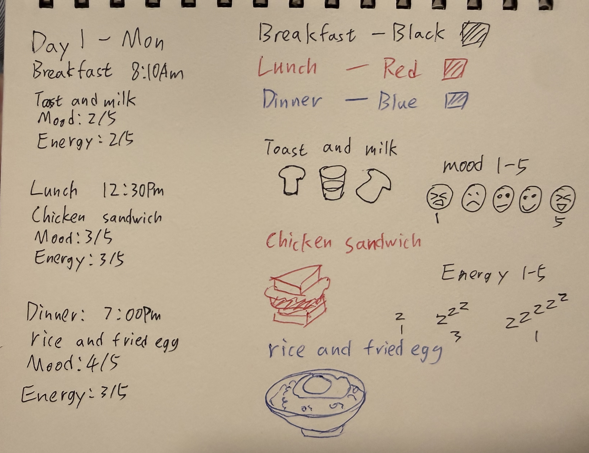
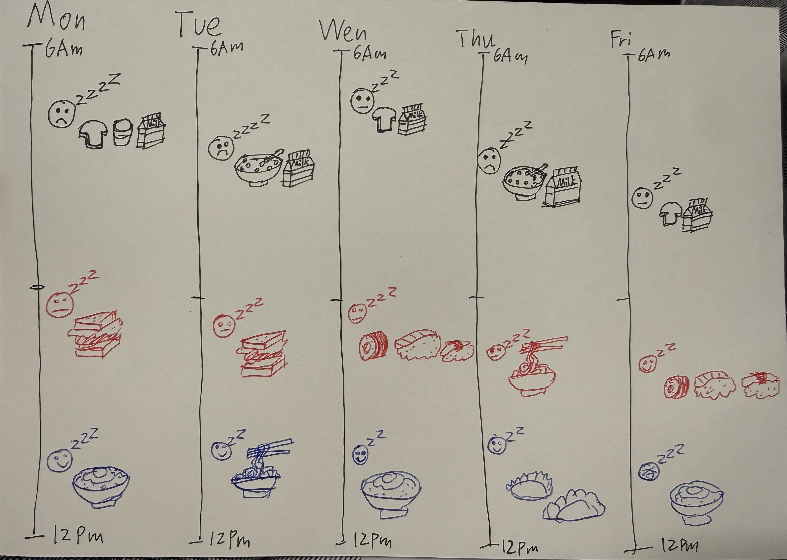

# Week 01 — Experiment 1: Data Drawings

## Overview

Week 01 was mainly about getting into what this course is actually about: data, visualisation, and how data can be treated as a creative material. The main task for this week was **Experiment 1: Data Drawings**, which had two parts: a **group data portrait** and an **independent data portrait**.

This entry records both parts of the experiment, as well as my first go at using Markdown for the Making Journal.

## Note on attendance

I missed the Week 01 studio, so for the group activity I worked back through the Week 01 brief, leacture recording and slides and then reconstructed the task by myself so I could still understand how the exercise worked.

For the group section only, I asked my friends as anonymous stand-in participants, since the original task was designed for a group of 4–5 people. Everything else here, including the visual decisions, reflections, and independent task, was done by me.

## Group Data Portrait

### What I was trying to do

The group task was about collecting small bits of personal data from a few people and turning that into a hand-drawn group portrait. I liked that the questions were supposed to be personal but still low-stakes. It makes the data feel more human and less like a survey.

Since I missed the class, I reconstructed the activity so I could still work through the process properly. 

### Questions

I came up with five questions based on the brief:

1. How many hours of sleep did you get last night?
2. How would you rate your energy right now from 1–5?
3. Whats one animal you seen today?
4. How focused do you feel right now from 1–5?
5. How many tabs are open on your phone right now?

### Anonymous participant responses

To simulate the group format, I am the participant A and asked my friends as four stand-in participants. I asked the questions to friends.

| Participant | Sleep (hrs) | Energy (1–5) | Animal | Focus (1–5) | Phone tabs |
|---|---:|---:|---:|---:|---:|
| A | 5 | 2 | Bird | 3 | 18 |
| B | 7 | 4 | Dog | 3 | 9 |
| C | 4 | 2 | Cat | 2 | 31 |
| D | 6 | 3 | Bird | 4 | 14 |
| E | 8 | 1 | lizard | 4 | 6 |

### How I planned to draw it

I planned the portrait as five different color, one for each participant. Each color used the same visual system so the differences between people would be easy to compare.

My visual system was:

- **Number of "Z" next to the face** = sleep hours
- **Sad face to happy face** = energy level
- **Animal drawing** = animal
- **Number of glasses next to the face** = focus level  
- **Number on a phone drawing** = number of phone tabs

What I liked about this system is that it lets the drawing show mood and texture, not just information. If the same answers were put into a spreadsheet, they would probably feel flatter and less personal.

*Rough sketch of the reconstructed group portrait.*

### Decoding the portrait

Since I was working alone, I asked my friend to send me a photo of their group’s drawing so I could still do the decoding activity by myself.

From what I could understand, their visualisation included data about things like how people travelled to campus, their age, concentration levels, how much sleep they got, and how many classes they had that day. I tried to read the repeated symbols, colours, and numbers to figure out what each part represented. Some parts were quite clear because the patterns stood out, but other parts were harder to read and felt more ambiguous.

This part of the exercise was helpful because it showed me that hand-drawn data visualisations can be interesting and expressive, but they also need to be clear enough for someone else to understand. From the drawing, I could tell a few things about the group, like the fact that bus travel came up a lot, and that people seemed to have very different sleep habits. A few details were also funny or surprising, especially where it looked like someone had very little sleep. At the same time, not everything was easy to decode. I could not fully work out what the yellow sections meant. That made me realise that good data visualisation is not only about creativity, but also about how clearly the information can be communicated to other people.

### Short reflection on this part

This decoding part made me think more carefully about the balance between creativity and clarity in data visualisation. I liked that the drawing felt personal, handmade, and more expressive than something like a spreadsheet, but it also showed that being visually interesting is not enough on its own. If the symbols, colours, or layout are too unclear, some of the meaning gets lost. 

Trying to interpret another group’s work made me pay more attention to how important the legend and overall structure are. It reminded me that a good data drawing should still feel human and personal, while also being clear enough that someone else can understand the main ideas from it.

---

## Independent Data Portrait

- [x] Complete Experiment 1: Data Drawings
- [x] Practice using Markdown to format your first entry in the Making Journal
- [x] Watch Giorgia Lupi’s TED talk about data humanism

After watching Giorgia Lupi’s TED talk on data humanism, I started thinking about data differently. Before this, I mostly saw data as something factual and objective, but the talk made me realise that numbers alone can leave a lot out. Things like emotion, mood, uncertainty, and small everyday experiences are also part of how we understand people, but they are much harder to measure.

What I found most interesting was the idea that data does not have to be cold or purely digital. It can be personal, hand-recorded, and even a bit messy. Using drawing, notes, and visual marks can make the data feel more human and help tell a story that a spreadsheet probably could not.

It also made me think that good data design is not just about accuracy, but about what you choose to notice and what kind of experience you want to communicate. That idea influenced how I approached this experiment, especially when planning how to collect and draw my own data by hand.

### What I chose to track

I chose to track my meals over five days, including breakfast, lunch, and dinner, the time I ate, my mood, and my energy level. I wanted to focus on something ordinary in my daily routine and see if recording it by hand would reveal patterns I normally would not notice.

### Why I picked this topic

I picked this topic because food is a simple part of my everyday routine, but it is also something I usually do without paying much attention to. Tracking my meals felt manageable over five days, while still giving me enough detail to notice small patterns. I was also interested in seeing whether the time I ate and what I ate had any connection to my mood and energy throughout the day. Since the project is about turning everyday life into data, this felt like a personal but easy topic to record by hand.

### Step 2: Collect data by hand

For my independent data portrait, I decided to track my meals over five days. I recorded what I ate for breakfast, lunch, and dinner, along with the time I ate, my mood, and my energy level. I chose this because eating is part of my normal routine, but I do not usually notice how repetitive it can be or how my mood and energy change across the day. Recording it by hand made these patterns easier to notice.

I kept the system simple so it would be easy to record in the moment. For each meal, I wrote down the time, the food, my mood from 1–5, and my energy level from 1–5. I also let some foods repeat across the five days, because that felt more realistic to my everyday eating habits.

### Data collection notes

#### Day 1
- **8:10 am** — Breakfast: toast and milk  
  Mood: 2/5  
  Energy: 2/5

- **12:30 pm** — Lunch: chicken sandwich  
  Mood: 3/5  
  Energy: 3/5

- **7:00 pm** — Dinner: rice and fried egg  
  Mood: 4/5  
  Energy: 3/5

#### Day 2
- **8:25 am** — Breakfast: cereal and milk  
  Mood: 2/5  
  Energy: 2/5

- **1:00 pm** — Lunch: chicken sandwich  
  Mood: 3/5  
  Energy: 3/5

- **6:50 pm** — Dinner: noodles  
  Mood: 4/5  
  Energy: 4/5

#### Day 3
- **7:55 am** — Breakfast: toast and milk  
  Mood: 3/5  
  Energy: 3/5

- **12:20 pm** — Lunch: sushi  
  Mood: 3/5  
  Energy: 3/5

- **7:20 pm** — Dinner: rice and fried egg  
  Mood: 4/5  
  Energy: 4/5

#### Day 4
- **8:40 am** — Breakfast: cereal and milk  
  Mood: 2/5  
  Energy: 2/5

- **12:45 pm** — Lunch: noodles  
  Mood: 3/5  
  Energy: 3/5

- **6:55 pm** — Dinner: dumplings  
  Mood: 4/5  
  Energy: 4/5

#### Day 5
- **9:00 am** — Breakfast: toast and milk  
  Mood: 3/5  
  Energy: 3/5

- **1:10 pm** — Lunch: sushi  
  Mood: 4/5  
  Energy: 4/5

- **7:35 pm** — Dinner: rice and fried egg  
  Mood: 5/5  
  Energy: 3/5

*Rough notes from grouping daily routing and coding.*

### Step 3: Design your visualisation 

*Sketch for the daily routing chart.*

### Quick observations

Over the five days, my breakfasts were usually simple and my energy was often lower in the morning. Lunch was more functional and depended on whether I was busy or in class. Dinner was usually the meal where I felt the most relaxed, and my mood was generally better by that time. Recording this by hand made me notice how my energy and mood changed across the day, not just what I was eating.

---

## Reflection

For this experiment, I chose to track my meals over five days by recording what I ate for breakfast, lunch, and dinner, as well as the time, my mood, and my energy level. I picked this because food is part of my everyday routine, but I do not usually stop to think about how repetitive it is or how it connects to how I feel throughout the day.

Collecting the data by hand made me pay more attention to small patterns. One thing I noticed quite quickly was that my meals were often quite repetitive, especially breakfast and dinner. Instead of being a problem, I think that actually made the data more honest, because it reflects how I normally eat. My breakfasts were usually simple, my lunches changed a little more depending on the day, and dinner was often the meal that felt the most filling and satisfying.

I also noticed that my mood and energy were usually lower in the morning and a bit better later in the day. Breakfast entries often had lower scores, while dinner was usually where my mood was highest. That made me realise that the data was not really just about food, but also about daily rhythm. Even simple meals started to show a pattern when they were written down over several days.

For the data collection, I kept the system simple by focusing on four things: meal, time, mood, and energy level. Using a 1–5 scale for mood and energy made the notes quicker to record and easier to compare. At the same time, I left out a lot of other details, like portion size, nutrition, or who I ate with. Because of that, the data is not complete, but it still captures a personal view of my routine.

This relates to data humanism and *Dear Data* because it turns ordinary daily experiences into something more reflective and personal. The hand-drawn method keeps the data imperfect and human rather than trying to make it look too polished or scientific. Overall, this task made me more aware that even very simple habits can become interesting once they are treated as data.

---

## Working in Markdown

This was also my first proper try at writing a journal entry in Markdown. It feels simpler than working in a fully formatted document, but in a good way. Because everything is plain text, the structure is much more obvious. I had to think more clearly about headings, image placement, tables, captions, and the order of sections.

For this entry I used:

- headings to split the journal into sections
- tables to summarise responses and patterns
- lists to explain methods and visual systems
- image embeds and captions to place process evidence next to the writing

I can see why the course uses Markdown for the journal. It is simple, readable, and easy to edit, but still structured enough to become a website.

---

## Week 01 takeaways

- Small personal data can be more interesting than expected.
- The way something is drawn changes how the data feels.
- Hand-drawn work can hold ambiguity better than a standard chart.
- Data collection is already a form of interpretation.
- Paying attention to everyday habits changes how visible they become.

---

## AI Acknowledgement

I used ChatGPT in a limited way for this entry. Assist with brainstorming ideas and refining the wording of written sections in this journal entry, 

The conceptual development, data recording, and visual design decisions were completed independently.

AI assistance was limited to editing, language refinement, and discussion of ideas, and all final content was reviewed and done by me.

### AI tool reference

OpenAI. (2026). ChatGPT (Mar 14 version) [Large language model]. https://chat.openai.com/