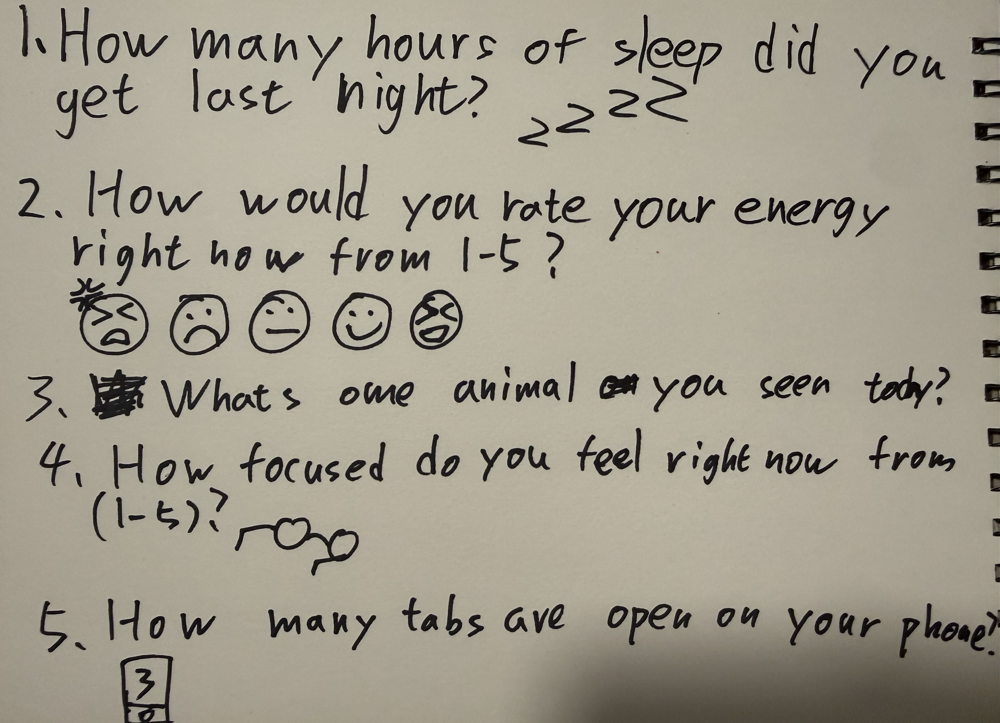
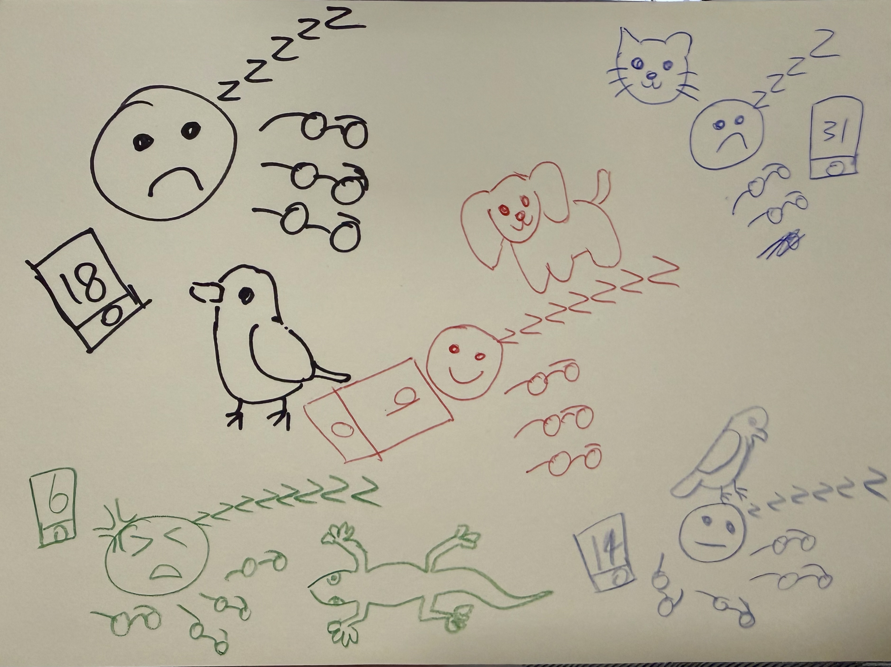

# Week 01 — Experiment 1: Data Drawings

## Overview

Week 01 was about data, visualisation, treating data as a creative material, and data humanism. The main task was **Experiment 1: Data Drawings** — both a group portrait and an independent one. This documents what I did with both, and also my first time trying to use Markdown for a journal.

## Note on attendance and method

I missed the live studio, so I worked through the slides, recording, and brief independently and reconstructed the workshop myself.

For the group activity, I used ChatGPT to generate fake participant data so I could test the format. Everything else—the structure, the visual system, the decoding, the independent portrait, and the reflections—is mine.

---

## Group Data Portrait (Reconstructed)

### Overview

The task was to work in groups of 4–5, collect personal data from each other, and turn it into a hand-drawn portrait. What I liked about it was that it didn't ask for demographic stuff. It focused on small, slightly messy details—things that are more human.

Since I missed it, I reconstructed the workshop to understand how it works as a design exercise.

### Step 1 — Questions

I wrote five questions. Tried to make them personal but still ordinary.

1. What were you thinking about on the way to class today?
2. How many hours of sleep did you get last night?
3. What sound did you notice this morning?
4. On a scale of your own invention, how are you feeling right now?
5. How many tabs are open on your phone right now?

### Stand-in participant responses

I generated five fake people.

| Participant | Thought on the way to class | Sleep | Sound noticed | Feeling scale | Phone tabs |
|---|---|---:|---|---|---:|
| A | Thinking about unfinished work | 5.5 | bus brakes | 3/5, functional but foggy | 18 |
| B | Wondering what to eat later | 7 | birds outside the window | sunny but slow | 9 |
| C | Mentally replaying a conversation | 4 | keys hitting a table | 2/5, scattered | 31 |
| D | Thinking about rent and deadlines | 6 | footsteps in a hallway | held together by coffee | 14 |
| E | Thinking about nothing in particular | 8 | shower water | 4/5, calm | 6 |

### Step 2 — Visual system

I planned vertical clusters for each person instead of a chart. Wanted it to feel more like a character sketch.

#### Encoding system

- **Column position** = participant
- **Circle size** = sleep
- **Line around circle** = feeling
  - smooth = calm
  - broken = foggy
  - dense scribble = stressed
- **Icon above** = morning sound
  - zigzag = bus brakes
  - curved = birds
  - square = keys
  - short lines = footsteps
  - droplets = shower
- **Handwritten phrase** = thought
- **Grouped dots** = phone tabs

This made me think about what drawing can show that a spreadsheet can't. A spreadsheet flattens everything. Drawing lets you show mess, rhythm, contrast.

*Initial sketch for the reconstructed group portrait.*

*Legend showing how sleep, sound, mood, and phone tabs were encoded.*

### Step 3 — Decode

Since I couldn't exchange portraits with another group, I wrote decoding notes like another group might have.

#### Decoding notes

- Everyone's tired but differently. Some calm, some overloaded.
- The phone tabs vary wildly—6 to 31.
- The handwritten thoughts and sound icons feel more intimate than a normal chart.
- You can't pinpoint exactly who is who, but you can sense different personalities in the marks and spacing.

#### Questions that came up

- Do people with less sleep also look scattered?
- Are many tabs stress, curiosity, or just how someone works?
- Which parts feel factual vs. interpretive?
- Would different marks make the same data feel totally different?

### Reflection on the reconstructed group task

Doing this alone was strange, but it helped me see what the exercise actually does. It's not about getting numbers right. It's about turning fragments of someone's day into visible marks. The best answers were the messy ones—"held together by coffee," "sunny but slow." Those carry feeling and context in them.

This connects to what we talked about with data humanism: data doesn't have to become inhuman to be useful. Sometimes it matters more when it stays connected to feeling and imperfection.

---

## Independent Data Portrait

### Topic

I tracked **how I felt when I picked up my phone**.

### Why this topic

It's such an invisible habit. You just grab it without thinking. But it's not neutral—sometimes it's a tool, sometimes procrastination, sometimes just fidgeting. I wanted to look at that moment before the screen takes over.

Also: phone use gets measured as screen time, which is just a number. But the number doesn't say why. It doesn't capture the feeling that made you reach for it.

### Step 1 — Collecting the data

I looked back five days and tried to remember the pattern. No app or timer—just writing down what I remembered. I grouped moments by feeling and whether it was on purpose or automatic.

Categories:
- **neutral**
- **curious**
- **stressed**
- **bored**
- **avoidant**

Then separated into:
- **intentional**
- **automatic**

### Five-day pattern summary

| Day | Main reasons | Feeling |
|---|---|---|
| Day 1 | messages, time, music | scattered, neutral |
| Day 2 | notifications, scrolling | restless, escaping |
| Day 3 | maps, messages, camera | purposeful |
| Day 4 | alarms, weather, avoiding work | rushed |
| Day 5 | messages, scrolling, tasks | tired, autopilot |

### Step 2 — Designing the visualisation

I used rings instead of bars. Wanted the shape to feel like looping and repeating—because that's what phone use feels like.

#### Visual language

- **One ring** = one day
- **Each mark** = one pickup
- **Colour** = feeling
- **Shape** = intentional or habit
  - triangle = on purpose
  - dot = automatic
- **Distance from center** = how urgent
- **Notes around it** = triggers like "reply," "bored," "weather check"

Building through repetition instead of one number felt right. I wanted the final drawing to look slightly frantic and compulsive, because that's closer to what phone use actually is.

*Rough handwritten notes used to group recurring phone-pickup moments across five days.*

*Sketch for the independent circular data portrait.*

*Legend showing how colour, shape, and distance were used in the personal data portrait.*

---

## Reflection

Once I started paying attention to that moment before opening an app, it stopped feeling invisible. What surprised me was how many pickups weren't about looking for something. They were restlessness, time-wasting, habit. That matters because a screen time number would never show it.

The drawing made a real difference. A bar chart would look organized. But phone use doesn't feel organized. It feels repetitive and slightly compulsive. So the dense circular drawing felt closer to the actual experience.

I read about Giorgia Lupi and *Dear Data* in the Week 01 materials. That's what data humanism seems to mean—you don't have to strip away the mess to make something meaningful. Sometimes the mess is the point.

There's also a problem: I was remembering this, not tracking it live. So this is my memory of patterns, not a precise log. Which means it's already interpretation. But that made me realize how much interpretation happens even when you're collecting data. You're always choosing what to notice.

---

## Working in Markdown

First time using Markdown seriously for something longer. It's simpler than a formatted document, but more deliberate. Everything is plain text, so structure becomes visible. Headings, lists, tables, images—they all have to be clear.

I used:

- headings to break things into sections
- tables for data summaries
- lists for methods and visual systems
- images with captions next to reflection

It's lightweight enough that it doesn't get in the way of the work.

---

## Week 01 takeaways

- Small details can carry meaning.
- You don't need large data sets to be interesting.
- Drawing shows mood and uncertainty better than charts do.
- How you collect data shapes what you'll see.
- Drawings are interpretation, not neutral presentation.

---

## AI Acknowledgement

ChatGPT was used only to generate the fake participant data for the group portrait. Everything else—the reconstruction, the topic choice, the visual systems, the drawings, the reflections—was me.