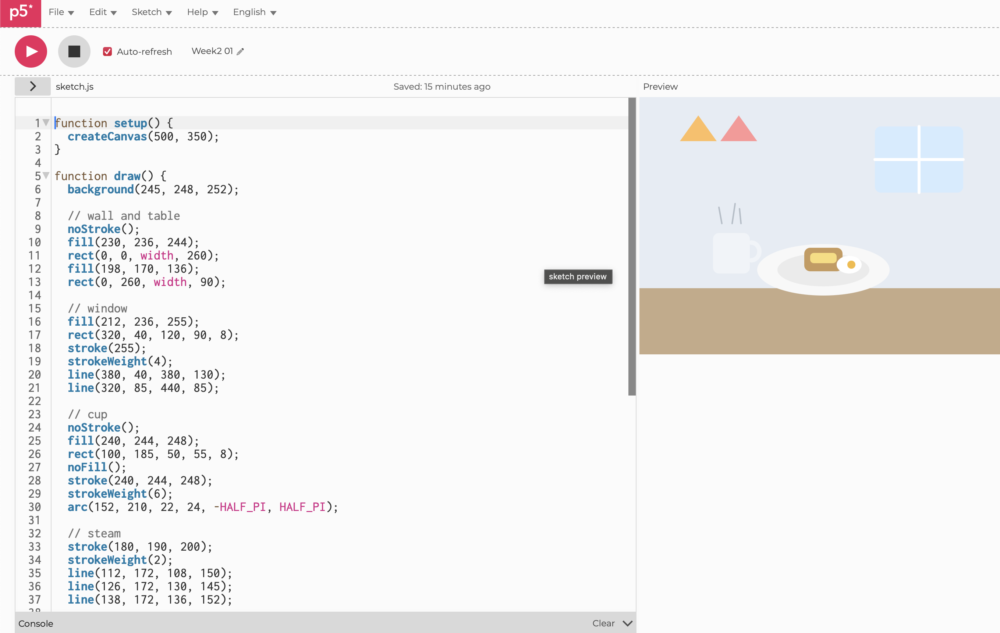
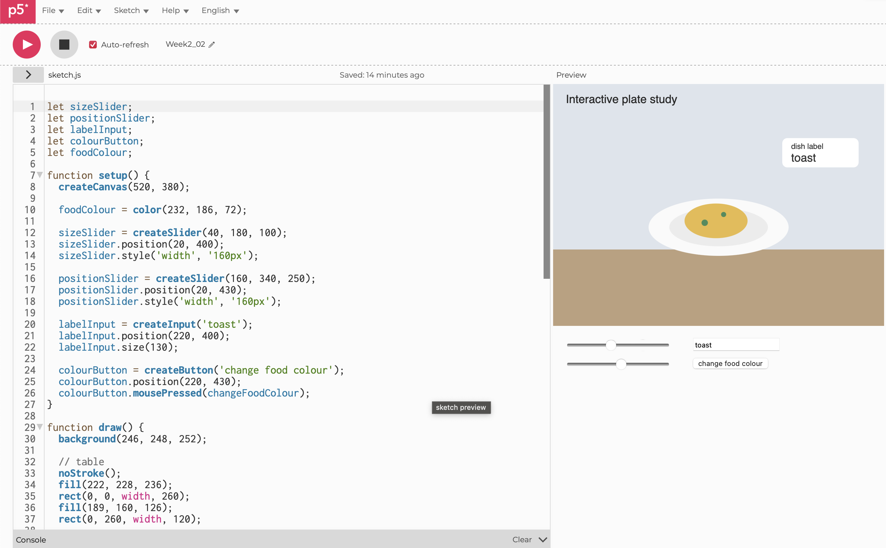
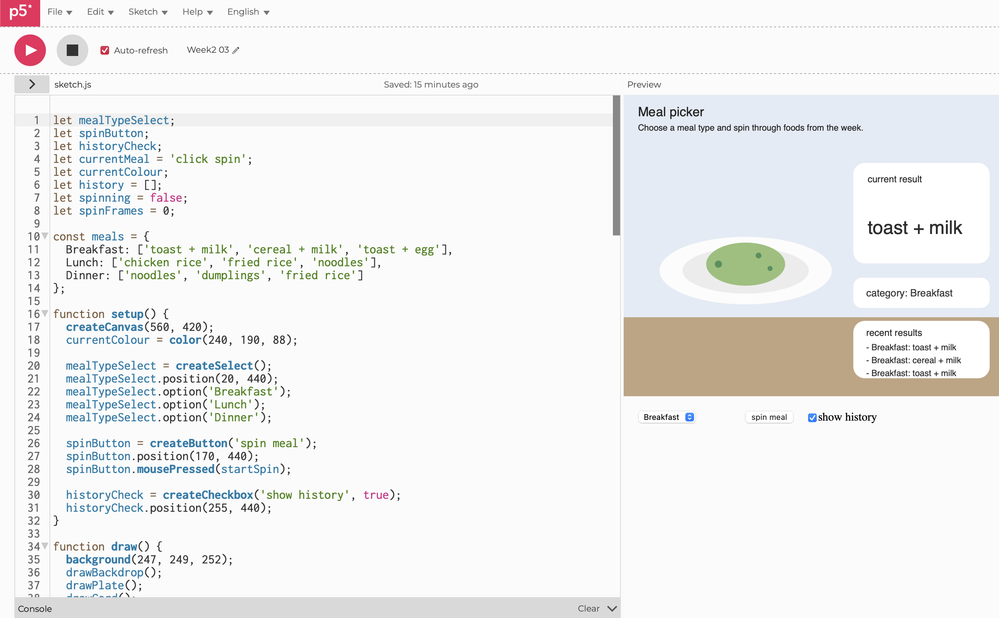
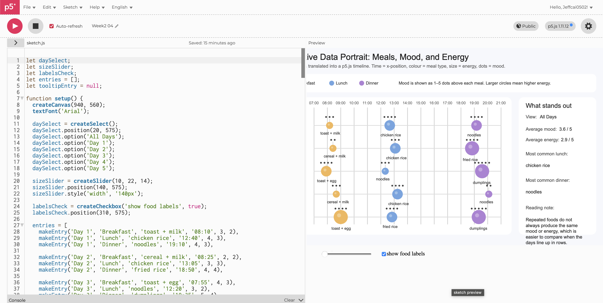
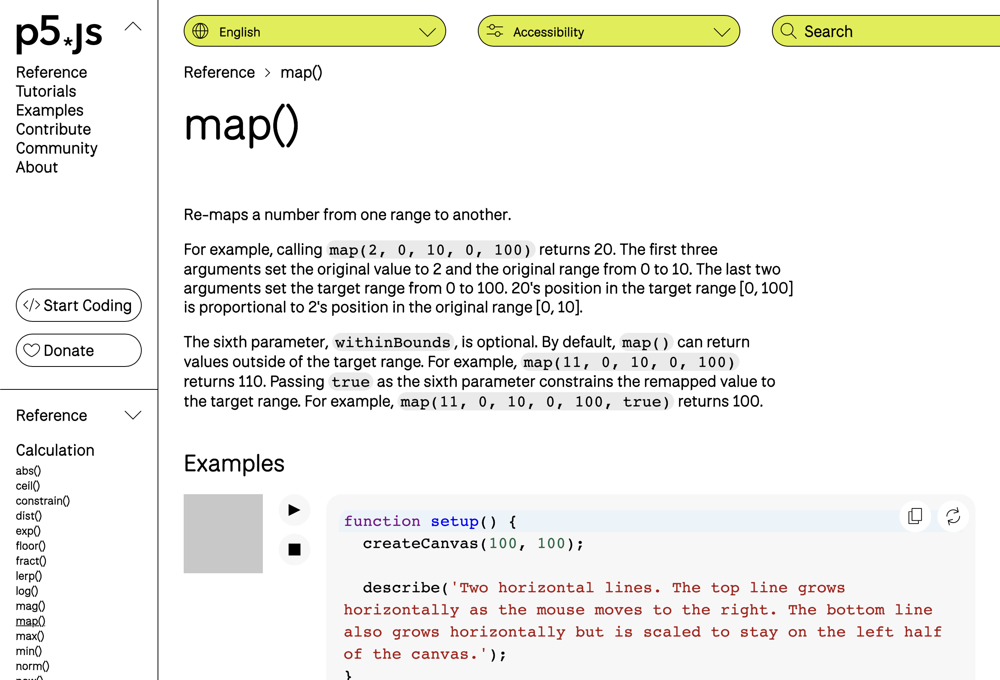

# Week 02

[← Back to Home](../index.md)

# DES240 Experiment 2: Interactivity

## Pair Exchange of Data Portrait


*Pair exchange discussion about my Week 01 food data portrait.*

 I showed my Week 01 data portrait based on five days of tracking breakfast, lunch, and dinner. I recorded what I ate, the time, my mood, and my energy level for each meal. Explaining the drawing out loud helped me see which parts of the portrait were doing the most work. The repeated lunches were very obvious, while breakfast and dinner showed more variation. My partner also understood the mood and energy parts quite quickly, which made me feel that the hand-drawn version was already communicating more than just a meal log.

The discussion also helped me decide what to carry forward into code. I did not need to translate every part of the drawing. The most interesting parts were time, repetition, mood, and energy, That conversation gave me the direction for my interactive sketch later in the week.

## Experiment of p5.js


*My first p5.js composition using basic shapes.*


[Try it on p5.js Editor](https://editor.p5js.org/Jeffcai0502/full/eMtGVQ7Cr)

To get comfortable with the p5.js editor, I started with a very simple composition. I made a small breakfast-table scene using `rect()`, `ellipse()`, `triangle()`, and `line()`. The point of this was not to make a complicated image, but to understand how the canvas works, how shapes are layered, and how changing the order of instructions affects the final result. I also experimented with colour, stroke weight, and position.

What I noticed straight away was that coding a picture feels very different from drawing by hand. In a sketchbook I usually think visually first, but in p5.js I had to think in steps. The image only worked once I understood the order that things were drawn. That made the canvas feel less like a blank page and more like a system.

```js
function draw() {
  background(245, 248, 252);
  rect(0, 260, width, 90);
  ellipse(250, 235, 180, 70);
  triangle(80, 130, 130, 40, 180, 130);
}
```

## Make an Interactive Sketch

[Try it on p5.js Editor](https://editor.p5js.org/Jeffcai0502/sketches/jFes-66an)


*Interactive sketch using sliders, a button, and a text input.*

After that, I made a small interactive sketch using DOM controls. I kept the visual simple so I could focus on how the controls changed the canvas. In this sketch, a slider changes the size of the food on the plate, another slider moves it horizontally, a button randomises the colour, and a text input lets me rename the dish. This was my first time seeing how page elements and canvas drawing could work together.

The most useful part of this exercise was the immediacy. With a hand-drawn image, the viewer mostly receives a finished result. With DOM elements, the viewer actively changes the drawing. Even with a very basic setup, that changed the feeling of the work. It started to make sense why the course frames buttons, sliders, and inputs as digital equivalents of physical interaction.

```js
sizeSlider = createSlider(40, 180, 100);
positionSlider = createSlider(160, 340, 250);
labelInput = createInput('toast');
colourButton = createButton('change food colour');
```

## Build a More Ambitious Interactive Sketch

[Try it on p5.js Editor](https://editor.p5js.org/Jeffcai0502/sketches/4k7gkyXDJ)


*More ambitious p5.js sketch with multiple controls and a simple animation.*

For this part, I wanted to make something more playful and closer to my Week 01 topic, so I tried building a meal-based interactive sketch. My original idea was to make a viewer click through different meals and have a random food image appear each time, so it would feel less like a basic coding exercise and more like a small interactive experience.

I could only get part of that working properly. I managed to make the sketch change colour and respond to controls, but I did not fully figure out how to make the random food images display in the way I wanted. I spent quite a while trying different approaches, but the image part kept breaking or not showing up correctly, so I simplified the sketch and kept the parts that were stable.

AI helped quite a lot in this stage. I used it to suggest the structure of the sketch, especially for the dropdown, button logic, and some of the animation behaviour. I still had to test the code myself, paste it into p5.js, work out what was going wrong, and simplify parts that were too ambitious for where I am at right now. So I would say this sketch was partly directed by me and partly built with AI support.

What I learned from this is that having an idea in words is much easier than actually getting every part of it to work in code. It also showed me that AI can help me get started quickly, but I still need to understand enough to judge what is usable and what needs to be changed. Next week I want to try doing more of the code by myself first, even if the result ends up simpler.

## Independent Study: Interactive Data Portrait

[Try it on p5.js Editor](https://editor.p5js.org/Jeffcai0502/sketches/T0TGwrdxj)


*Overview of my interactive data portrait based on five days of meals.*

For the independent study task, I translated my Week 01 hand-drawn data portrait into a p5.js sketch. I used the same five-day dataset about my meals: breakfast, lunch, and dinner, including what I ate, the time, mood level, and energy level. I did not try to copy the hand-drawn version exactly. Instead, I focused on making the data easier to explore through interaction.

This part relied on AI more heavily than the earlier exercises. I already knew what I wanted the sketch to show, but I needed help turning that idea into working code. I used AI to help build the main structure, including the day filter, slider, hover behaviour, and parts of the visual mapping. After that, I tested it in p5.js, adjusted labels, changed some layout choices, and simplified parts so the sketch matched my own dataset better. Because of that, I see this one as a mix of my own design decisions and AI-assisted coding.

I chose to represent each meal as a circle on a timeline. The horizontal position shows the time of day, each row represents a different day, and the size of the circle relates to energy level. I separated mood from energy instead of combining them, because in my Week 01 drawing I already noticed that those two things do not always match. Keeping them separate made the sketch feel more accurate to my experience.

The interactive controls made the sketch much more useful than the hand-drawn version. A dropdown lets the viewer look at all days or focus on one day at a time. A slider changes the scale of the circles, which helps make energy differences more visible. I also used hover information so the screen does not have to show every detail at once. That made it easier to keep the sketch readable while still letting the viewer inspect specific meals.

This process also made me think more carefully about my own workflow. AI was useful, especially for getting past parts of the code I did not know how to write yet, but I do not want to depend on it too much. From next week on, I want to try doing more of the structure and logic myself first, even if the final code is more simple. I think that will help me understand the process better and make the work feel more fully mine.

## Notes from Tutorials



Outside of the main class exercises, I spent some time going back through the p5.js tutorials and reference pages to understand the basics more clearly. The most useful ideas for me were variables, the `draw()` loop, and how values can be mapped into visual changes on the canvas.

At first, I was mostly thinking about p5.js as a way to draw shapes, but the tutorials helped me understand that the important part is actually how values change over time. Once I understood that `draw()` keeps running again and again, it became much easier to understand movement, hover effects, and interactive feedback. That was the point where the coding started to make more sense to me.

I also looked more carefully at how one kind of data can be turned into another visual form. For example, a time value can become a position on the screen, and an energy rating can become the size of a circle. That idea ended up being really useful for my interactive data portrait, because it helped me translate everyday observations into a visual system instead of just placing shapes randomly.

Two lines that were especially useful for me were:

```js
let x = map(entry.minutes, 420, 1260, 120, width - 70);
let diameter = entry.energy * sizeSlider.value();
```

## Reflection

This week made interactivity feel much more important than I first thought. At the start, I kind of saw p5.js as just another way to make shapes on a screen, but after working through the exercises I started to understand that interaction changes how the data is experienced, not just how it looks. Compared to Week 01, where I worked by hand and made a personal data drawing, this week was more about letting the viewer move through the same data in their own way.

For my interactive data portrait, I used the meal dataset from Week 01: breakfast, lunch, and dinner across five days, including what I ate, the time, mood level, and energy level. I picked this because it was personal, easy to relate back to the hand-drawn version, and also structured enough to work in code. I did not try to translate every single part of the drawing. I focused on the parts that felt most useful to interact with, especially time, repetition, mood, and energy.

The main interactive elements I chose were a dropdown, a slider, and hover information. I picked those because they actually helped the data become clearer instead of just making the sketch look more complicated. The dropdown lets the viewer compare one day with the full week, the slider makes the energy differences easier to read, and the hover states keep the screen from getting too crowded. That balance between detail and clarity was something I had to think about more carefully than I expected.

What the interactive version can show more clearly than the hand-drawn one is repetition and comparison. In the paper version, the data feels more personal and expressive because of the way it is drawn by hand, but everything is visible at once. In the p5.js version, I could hide and reveal information when needed, which made the repeated lunches and changing mood/energy patterns much easier to notice. That was probably the most interesting thing I got from this week. Even when the meals repeated, the feeling around them did not.

I also learned quite a lot about my own process. I still tend to think visually first, but coding forced me to think more about structure, sequence, and relationships between values. AI helped me a lot, especially when I got stuck, but it also made me realise I do not want to rely on it too heavily. From next week on, I want to try building more of the code myself first, even if the outcome is simpler. I think that will help me understand what I am doing more clearly and make the work feel more honest to my own learning.


## AI Usage Statement

I used AI as part of my process for Week 02, mainly to help with p5.js coding. For the more ambitious interactive sketch, I used AI to suggest code structure and interactive features, but I still had to test the results, remove parts that were not working, and simplify the final outcome. For the interactive data portrait, AI helped more significantly with turning my Week 01 dataset into a working p5.js structure, including some of the filtering, hover behaviour, and layout logic.

The ideas, dataset, screenshots, and design direction were still chosen by me. I also adjusted parts of the generated code to better match my own project and to make the sketch easier to read. This process showed me that AI can be useful for support and problem-solving, but it also made me realise that I need to build more confidence in writing code myself. In future weeks, I want to rely less on AI and try to make more of the code independently, even if that means producing something simpler.

Grammarly used to correct my grammar and writing.

Grammarly Inc. (2026). Grammarly (Version 1.2.3) [Computer software]. https://www.grammarly.com/

OpenAI. (2026). ChatGPT (Mar 14 version) [Large language model]. https://chat.openai.com/