# Week 03

[← Back to Home](../index.md)

# DES240 Experiment 3: Live Data

## Pair Exchange of Interactive Data Portrait

I shared my Week 2 interactive sketches with a partner and talked through what a viewer could understand by interacting with them. I showed both the 

What I found useful about this discussion was that it made me think more clearly about what interaction actually adds. It is not just about making something move. It changes the way a viewer explores the work and how long they stay with it. If I had more time, I would keep developing the blackjack sketch with better visual feedback, more polished motion, and maybe sound.


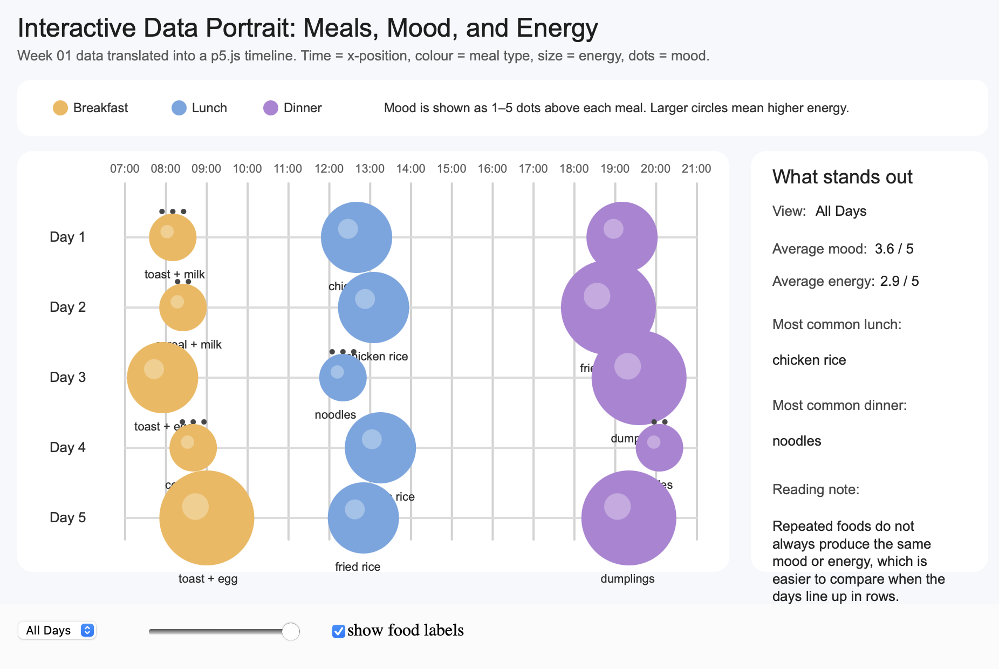

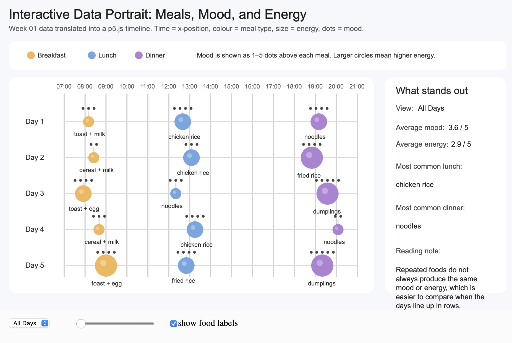

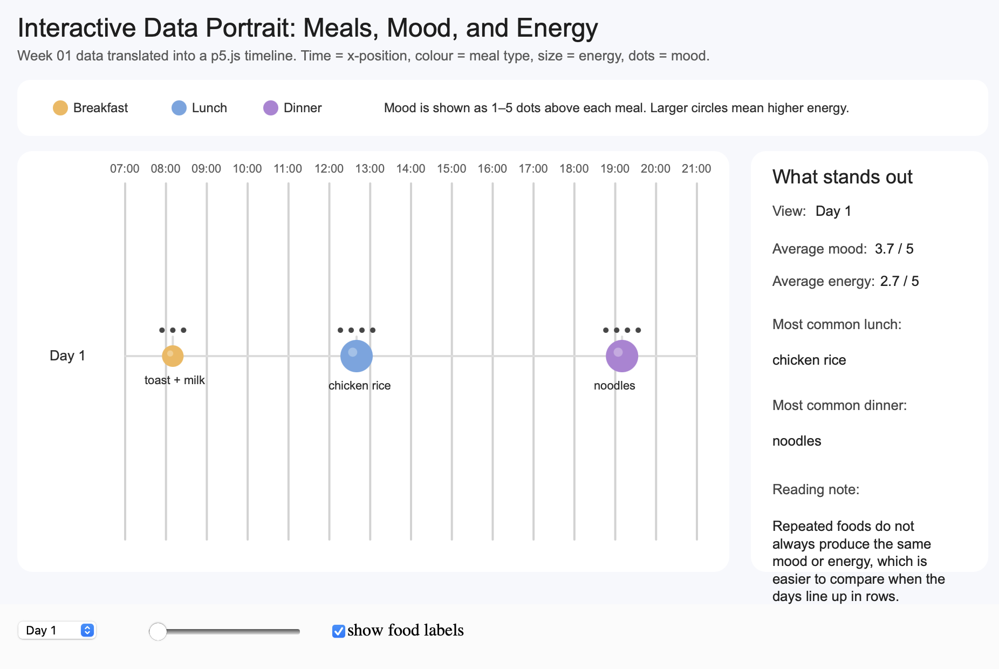


## Making Journal Check-In

Another part of the class focused on checking the journal setup. We reviewed the file structure, image paths, Markdown formatting, and whether the website was publishing properly through GitHub Pages. This was useful because it reminded me that the journal is not just somewhere to dump content. The structure of the site is part of the submission as well.

During this check, I noticed that some of my images were not loading correctly. The main issue was the image path. After fixing the relative path and pushing the changes again, the images displayed properly on the site. That small mistake was frustrating at first, but it helped me understand the workflow better and made me more careful with file organisation.

### Pair Exchange Checklist

- [x] file structure is correct
- [x] images are stored in `/assets/week-03/`
- [x] image links are working
- [x] Markdown formatting is consistent
- [x] website is published
- [x] images display correctly online


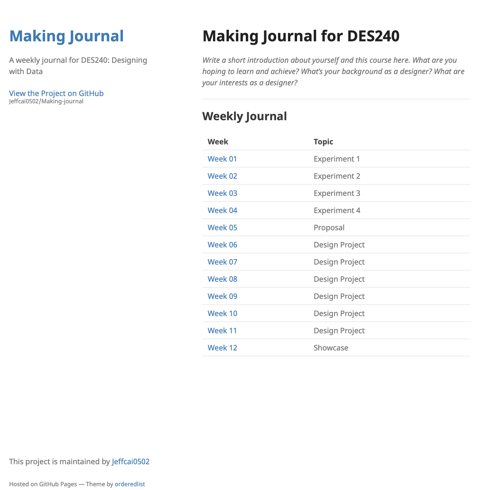
*Week 03 page visible on my GitHub Pages site.*


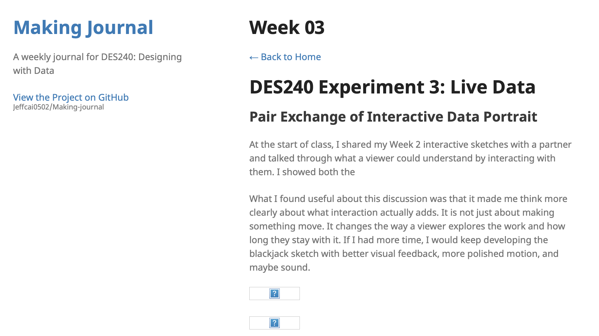
*After correcting the image path, the media displayed properly online.*
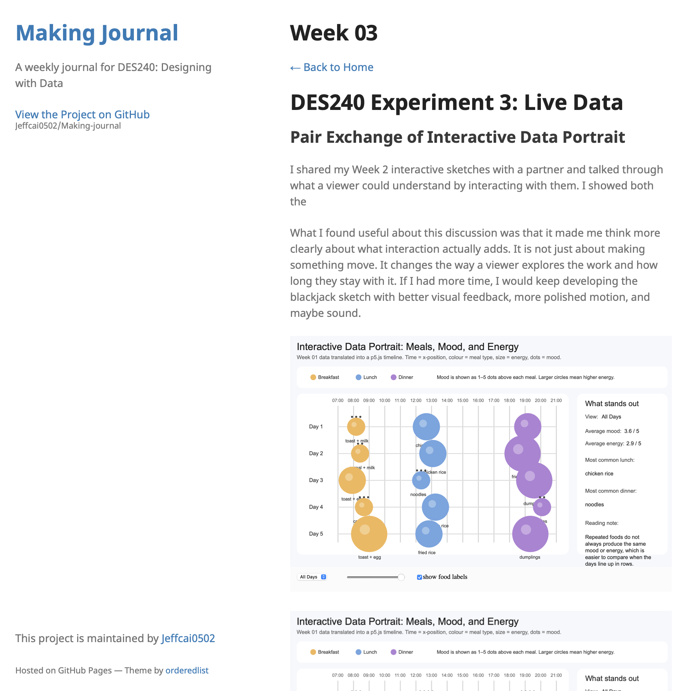

## Activity 1 – Exploring Live Data with `curl`

This part of the class introduced the terminal as another way of interacting with the computer. Instead of clicking through windows, I used simple commands to move through folders and create a text file. Although the task itself was basic, it made the command line feel much more approachable. I started to see it as a practical tool for working directly with data, not just something for programmers.

```bash
pwd
ls
cd Desktop
echo "Hello" > hello.txt
ls
```

<!-- Add screenshot: terminal navigation and hello.txt -->

*Using the terminal to navigate folders and create a text file.*

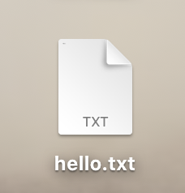

After that, we used `curl` to request live data from the internet. I tried the ASCII animations first, then weather information from `wttr.in`, and then raw JSON from the Free Dictionary API. This was one of the most useful moments of the class for me, because it showed the difference between reading information on a website and accessing the data itself. In a browser, most of the interface is built for people. In the terminal, what comes back feels much closer to raw material that can later be filtered, parsed, or visualised.

### Demo 1 – ASCII animation

```bash
curl ascii.live/forrest1
```

<!-- Add GIF or screenshot: ASCII animation in terminal -->
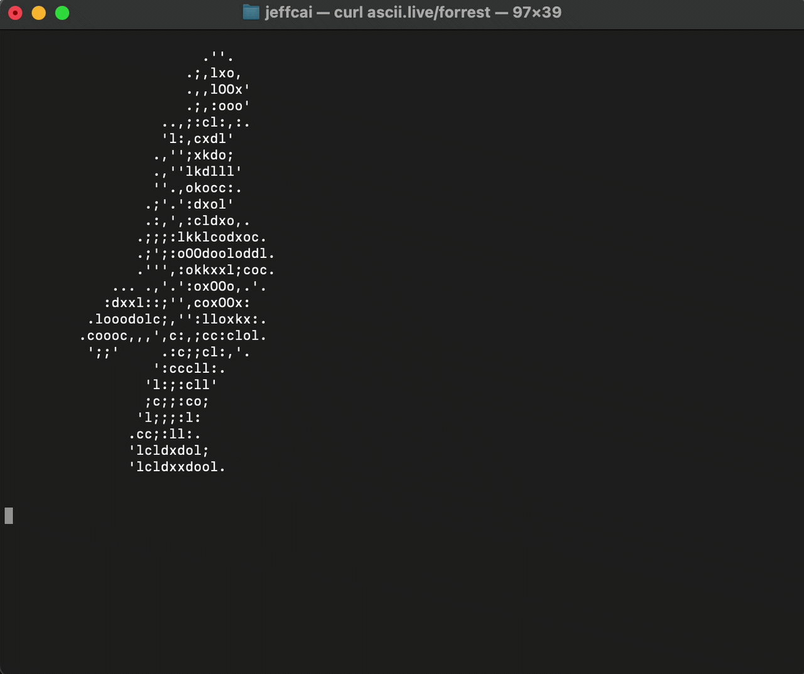
*Streaming ASCII animation in the terminal using `curl`.*

```bash
curl ascii.live/parrot
```

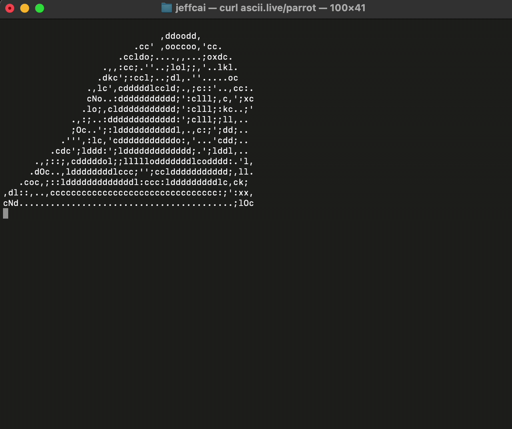

### Demo 2 – Weather output

```bash
curl wttr.in/Taipei
```

<!-- Add GIF or screenshot: wttr.in weather output -->
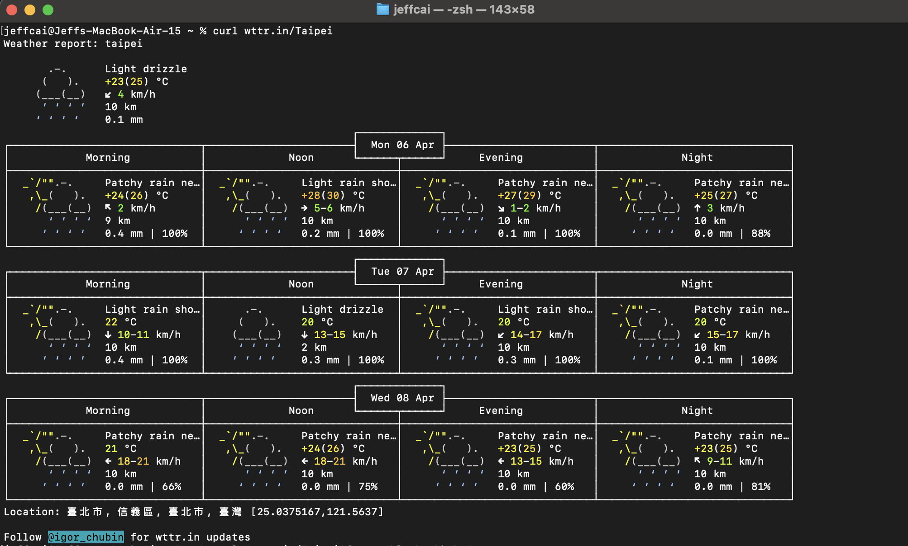
*Using `wttr.in` to retrieve a weather report in the terminal.*

### Demo 3 – Filtering live data

```bash
curl "wttr.in/Taipei?format=%l:+%t+%h+%w"
```

<!-- Add GIF or screenshot: filtered wttr.in output -->

*Filtering live weather data so only selected values are returned.*

### Demo 4 – Raw JSON

```bash
curl https://api.dictionaryapi.dev/api/v2/entries/en/design
```

<!-- Add screenshot: raw JSON in terminal -->
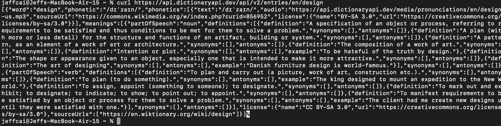
*Raw JSON returned by the dictionary API.*

Working with these examples made me realise that live data does not arrive ready-made as a polished visualisation. It arrives as text, parameters, and structured data. The design work happens in the translation.

## Activity 2 – Weather Visualisation in p5.js

For the weather sketch, I changed the example location from Auckland to Taipei. I first found the latitude and longitude, then used the Open-Meteo API to generate a URL with current weather values. I kept the first sketch simple so I could clearly see how each value was being mapped.

In the basic version, temperature controls the size of the main circle, humidity affects the background colour, and wind speed controls the width and weight of the bar near the bottom of the canvas. This was useful because it made the logic of API-based drawing very clear. Rather than manually choosing all the values, the sketch responds to information coming from outside the program.

<!-- Add screenshot: latitude and longitude source -->
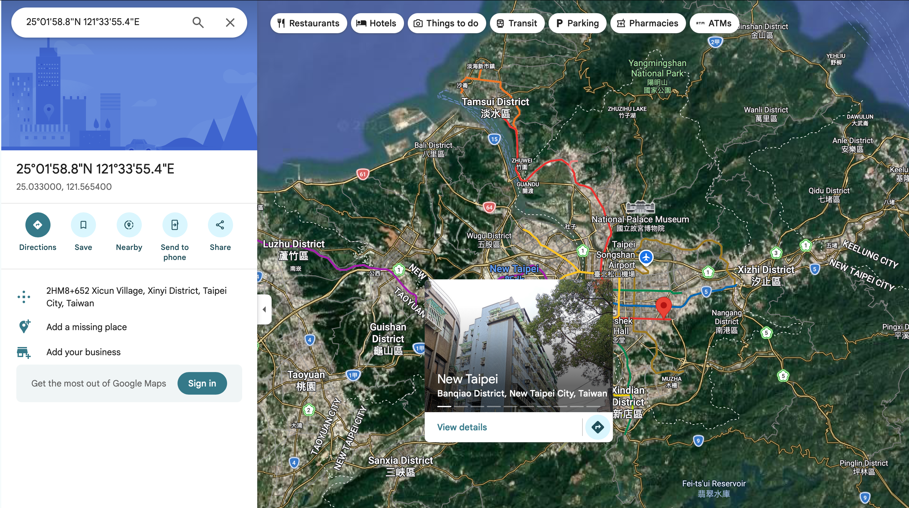
*Finding the latitude and longitude for Taipei before building the API request.*

<!-- Add screenshot: Open-Meteo settings or API URL -->
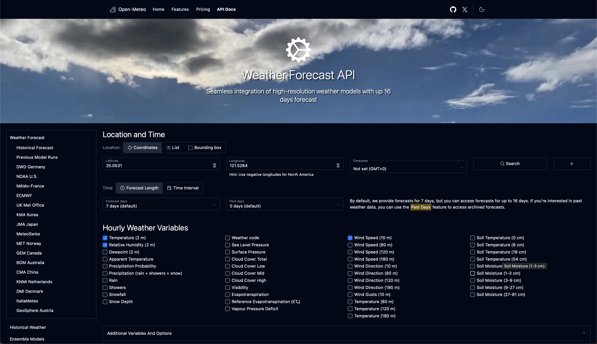
*Setting up the Open-Meteo API request for Taipei.*

[View the basic weather sketch](https://editor.p5js.org/Jeffcai0502/sketches/gOG-LETUy)

<!-- Add screenshot: basic weather sketch in p5.js -->
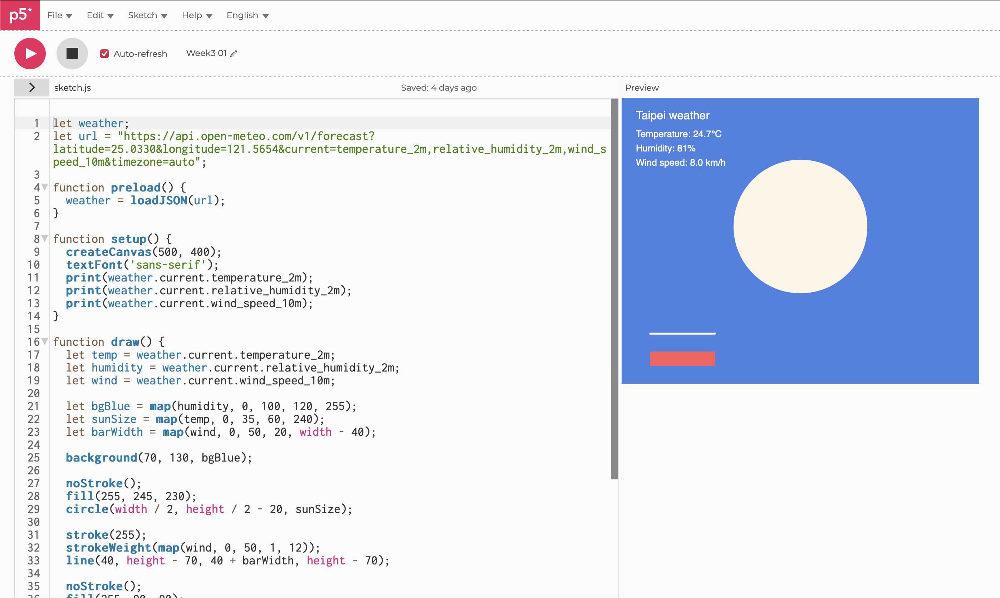
*Basic p5.js weather sketch using temperature, humidity, and wind speed.*

### Basic Weather Sketch Code

```javascript
let weather;
let url = "https://api.open-meteo.com/v1/forecast?latitude=25.0330&longitude=121.5654&current=temperature_2m,relative_humidity_2m,wind_speed_10m&timezone=auto";

function preload() {
  weather = loadJSON(url);
}

function setup() {
  createCanvas(500, 400);
  textFont('sans-serif');
  print(weather.current.temperature_2m);
  print(weather.current.relative_humidity_2m);
  print(weather.current.wind_speed_10m);
}

function draw() {
  let temp = weather.current.temperature_2m;
  let humidity = weather.current.relative_humidity_2m;
  let wind = weather.current.wind_speed_10m;

  let bgBlue = map(humidity, 0, 100, 120, 255);
  let sunSize = map(temp, 0, 35, 60, 240);
  let barWidth = map(wind, 0, 50, 20, width - 40);

  background(70, 130, bgBlue);

  noStroke();
  fill(255, 245, 230);
  circle(width / 2, height / 2 - 20, sunSize);

  stroke(255);
  strokeWeight(map(wind, 0, 50, 1, 12));
  line(40, height - 70, 40 + barWidth, height - 70);

  noStroke();
  fill(255, 90, 90);
  rect(40, height - 45, barWidth, 20);

  fill(255);
  textSize(16);
  text("Taipei weather", 20, 30);
  textSize(13);
  text("Temperature: " + nf(temp, 1, 1) + "°C", 20, 55);
  text("Humidity: " + nf(humidity, 1, 0) + "%", 20, 75);
  text("Wind speed: " + nf(wind, 1, 1) + " km/h", 20, 95);
}
```

After that, I made a second version that felt more alive. Instead of changing only static shapes, I added `noise()` so the main form could drift gently, and I added small moving particles pushed sideways by wind speed. I also included `cloud_cover` and `is_day` so the background could shift between a clearer daytime sky and a darker, cloudier mood.

This second version was still quite simple, but it pushed the sketch closer to the idea of atmosphere rather than just display. That was the part I found most interesting: the data started to feel less like numbers and more like a changing visual condition.

[View the animated weather sketch](https://editor.p5js.org/Jeffcai0502/sketches/U3zb2r5QB)

<!-- Add screenshot or GIF: animated weather sketch -->
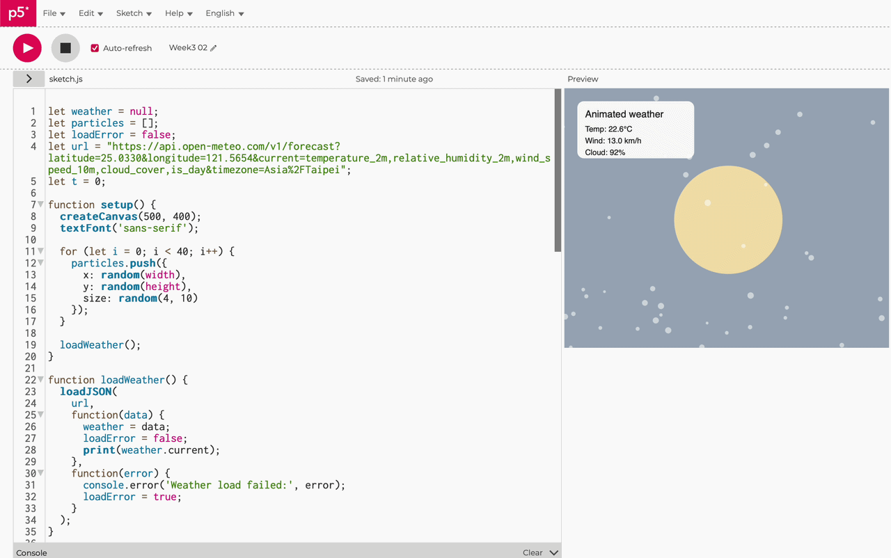
*Animated p5.js weather sketch using `noise()` and extra live weather variables.*
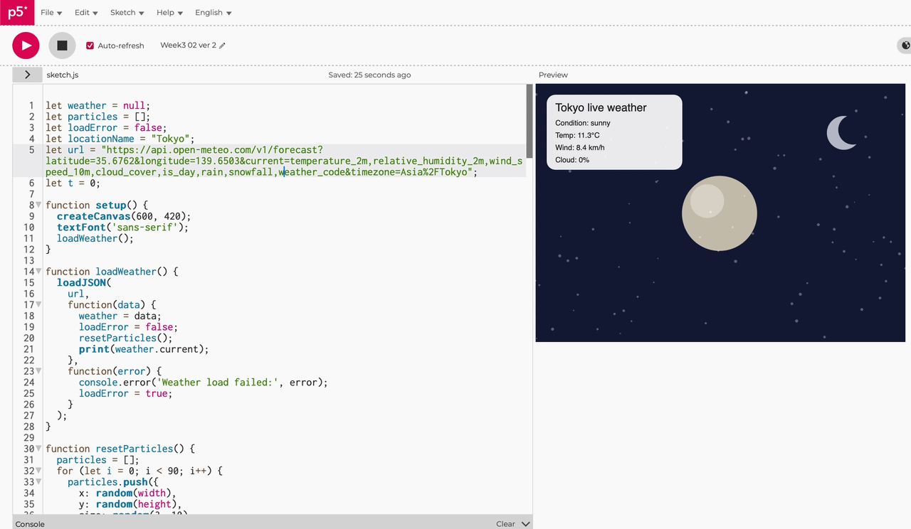
### Animated Weather Sketch Code

```javascript
let weather;
let particles = [];
let url = "https://api.open-meteo.com/v1/forecast?latitude=25.0330&longitude=121.5654&current=temperature_2m,relative_humidity_2m,wind_speed_10m,cloud_cover,is_day&timezone=auto";
let t = 0;

function preload() {
  weather = loadJSON(url);
}

function setup() {
  createCanvas(500, 400);
  textFont('sans-serif');

  for (let i = 0; i < 40; i++) {
    particles.push({
      x: random(width),
      y: random(height),
      size: random(4, 10)
    });
  }
}

function draw() {
  let temp = weather.current.temperature_2m;
  let humidity = weather.current.relative_humidity_2m;
  let wind = weather.current.wind_speed_10m;
  let cloud = weather.current.cloud_cover;
  let isDay = weather.current.is_day;

  let dayColour = color(135, 190, 255);
  let nightColour = color(20, 30, 70);
  let sky = isDay === 1 ? dayColour : nightColour;
  let cloudySky = lerpColor(sky, color(160, 170, 180), cloud / 100);
  background(cloudySky);

  let mainSize = map(temp, 0, 35, 70, 220);
  let wobble = map(wind, 0, 50, 2, 25);
  let x = width / 2 + map(noise(t), 0, 1, -wobble, wobble);
  let y = height / 2 + map(noise(t + 200), 0, 1, -wobble, wobble);

  noStroke();
  fill(255, 230, 170, 220);
  ellipse(x, y, mainSize, mainSize);

  for (let p of particles) {
    p.x += map(wind, 0, 50, 0.2, 2.5);
    p.y += map(noise(t + p.x * 0.01), 0, 1, -0.6, 0.6);

    if (p.x > width + 10) {
      p.x = -10;
      p.y = random(height);
    }

    fill(255, 255, 255, map(humidity, 0, 100, 80, 180));
    circle(p.x, p.y, p.size);
  }

  fill(255);
  rect(20, 20, 180, 88, 10);
  fill(30);
  textSize(15);
  text("Animated weather", 32, 45);
  textSize(12);
  text("Temp: " + nf(temp, 1, 1) + "°C", 32, 67);
  text("Wind: " + nf(wind, 1, 1) + " km/h", 32, 85);
  text("Cloud: " + nf(cloud, 1, 0) + "%", 32, 103);

  t += 0.01;
}
```

## Activity 3 – Design and Execute a Data Protocol

For the analogue exercise, I designed a simple protocol based on sound in the surrounding space. The source was the classroom environment, the frequency was every 10 seconds, and the mapping used square size to represent volume: small square for quiet, medium square for moderate sound, and large square for loud sound. If there was a stretch of silence, I marked it with a line.

What I liked about this task was that it showed how even a very simple rule system can produce unexpected results. Once the protocol was followed over time, a rhythm began to appear. Some parts clustered closely together, while some louder moments stood out sharply. It was also interesting to compare what I thought the protocol said with how someone else interpreted it. A few parts were more ambiguous than I expected, especially around spacing and timing.

That made the exercise feel closely connected to the idea of an API or a coded system. Even when the rules seem clear, the outcome still depends on interpretation, context, and the person following them.

<!-- Add photo: your protocol sheet -->

*My written data protocol for translating classroom sound into marks.*

<!-- Add photo: protocol output -->

*Output produced by following the sound protocol over time.*

## Independent Study – Live Data Visualisation

For the independent study, I chose the digital option and decided to work with earthquake data rather than weather. I wanted to continue using APIs and live data, but I also wanted to use a source that was different from the class example. I chose the USGS Earthquake Catalog API because it is public, structured, and easy to test in the browser before moving into p5.js.

I first checked the API response and looked at the structure of the GeoJSON data. From there, I focused on four main values: longitude, latitude, magnitude, and depth. These gave me enough information to make a simple but readable visual system. Longitude and latitude control position on the canvas, magnitude controls circle size, and depth affects the colour.

I kept the final design quite straightforward on purpose. I did not want to make it overly complicated. Instead, I focused on making the information readable and clearly connected to the data. I added a grid, a title, and a small legend so that the sketch would feel more like a visualisation and less like a random field of circles.

<!-- Add screenshot: USGS API in browser or JSON -->
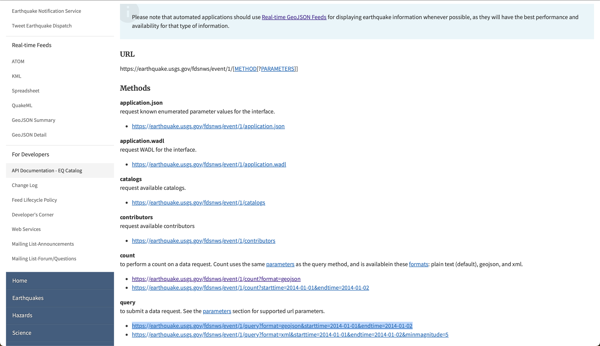
*Testing the USGS earthquake API and reading the GeoJSON response.*

[View the earthquake sketch](https://editor.p5js.org/Jeffcai0502/sketches/DCJaAco58)

<!-- Add screenshot: first version of earthquake sketch -->
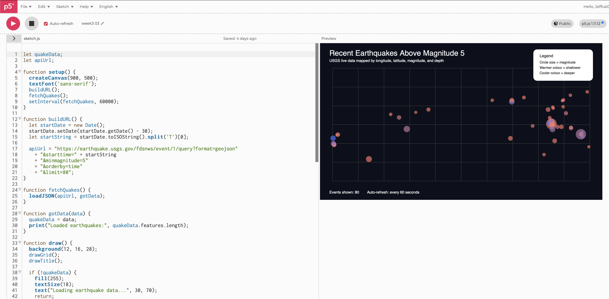
*First version of the earthquake sketch, focused on basic mapping.*

<!-- Add screenshot or GIF: refined final earthquake sketch -->

*Refined version with a grid, title, and legend for better readability.*

### Earthquake Sketch Code

```javascript
let quakeData;
let apiUrl;

function setup() {
  createCanvas(900, 500);
  textFont('sans-serif');
  buildURL();
  fetchQuakes();
  setInterval(fetchQuakes, 60000);
}

function buildURL() {
  let startDate = new Date();
  startDate.setDate(startDate.getDate() - 30);
  let startString = startDate.toISOString().split('T')[0];

  apiUrl = "https://earthquake.usgs.gov/fdsnws/event/1/query?format=geojson"
    + "&starttime=" + startString
    + "&minmagnitude=5"
    + "&orderby=time"
    + "&limit=80";
}

function fetchQuakes() {
  loadJSON(apiUrl, gotData);
}

function gotData(data) {
  quakeData = data;
  print("Loaded earthquakes:", quakeData.features.length);
}

function draw() {
  background(12, 16, 28);
  drawGrid();
  drawTitle();

  if (!quakeData) {
    fill(255);
    textSize(18);
    text("Loading earthquake data...", 30, 70);
    return;
  }

  for (let feature of quakeData.features) {
    let lon = feature.geometry.coordinates[0];
    let lat = feature.geometry.coordinates[1];
    let depth = feature.geometry.coordinates[2];
    let mag = feature.properties.mag;

    let x = map(lon, -180, 180, 40, width - 40);
    let y = map(lat, 90, -90, 80, height - 60);
    let size = map(mag, 5, 8, 10, 40, true);
    let r = map(depth, 0, 300, 255, 80, true);
    let b = map(depth, 0, 300, 100, 255, true);

    noStroke();
    fill(r, 120, b, 170);
    circle(x, y, size);
  }

  drawLegend();

  fill(255);
  textSize(12);
  text("Events shown: " + quakeData.features.length, 30, height - 20);
  text("Auto-refresh: every 60 seconds", 150, height - 20);
}

function drawGrid() {
  stroke(60);
  strokeWeight(1);

  for (let x = 40; x <= width - 40; x += 82) {
    line(x, 80, x, height - 60);
  }

  for (let y = 80; y <= height - 60; y += 60) {
    line(40, y, width - 40, y);
  }
}

function drawTitle() {
  noStroke();
  fill(255);
  textSize(24);
  text("Recent Earthquakes Above Magnitude 5", 30, 40);
  textSize(12);
  text("USGS live data mapped by longitude, latitude, magnitude, and depth", 30, 60);
}

function drawLegend() {
  noStroke();
  fill(255);
  rect(width - 220, 20, 190, 100, 12);

  fill(20);
  textSize(13);
  text("Legend", width - 200, 45);
  textSize(11);
  text("Circle size = magnitude", width - 200, 65);
  text("Warmer colour = shallower", width - 200, 82);
  text("Cooler colour = deeper", width - 200, 99);
}
```

### What the Work Reveals

What I like about this sketch is that the data becomes easier to compare almost immediately. In raw JSON, the information is there, but it is difficult to hold in your head as a whole. Once it is mapped visually, clusters and differences become much more obvious. It becomes possible to notice where events are concentrated, which earthquakes are stronger, and how depth changes the feeling of the visual field.

This also made me think differently about live data. Even though the sketch is quite simple, it is still connected to an external system that keeps changing. That gives it a more open-ended feeling than a fixed dataset. The drawing is not a final picture in the same way as a static poster. It is a system that can return a slightly different result each time it updates.

### Relation to Practitioner Examples

This work connects most strongly to David Bowen’s *Tele-Present Wind*, because both translate external live data into a visual system rather than simply showing a text readout. It also relates to Natalie Jeremijenko’s *Dangling String* in the sense that the data becomes something to perceive and interpret, rather than something only to read directly.

At a broader level, the sketch also connects to ideas from generative and conditional design. The final image is not manually arranged point by point. Instead, it emerges from a set of rules: fetch the data, extract selected values, map them to position, size, and colour, and let the composition form through the system.

## Reflection

This week changed the way I think about data in design. In the first two weeks, I was mainly working with data I collected myself, so the material felt personal and relatively controlled. This week was different because the data came from external systems. That made the work feel more technical, but it also made it more connected to the world outside the studio.

The terminal and `curl` exercises were especially useful because they showed me where data actually starts. Before that, I mostly thought about the finished interface: a weather app, a dictionary website, or a nicely designed page. Seeing the raw text and JSON made the process feel much more direct. It also made the later p5.js work make more sense, because I could see the full chain from request to response to visual translation.

The weather sketches helped me understand that live data does not need to be turned into a chart to be meaningful. Even a simple sketch can communicate temperature, humidity, wind, and cloud cover in a way that feels visual and atmospheric. The second version pushed this further by making the sketch feel more alive rather than just informative.

The earthquake sketch taught me something slightly different. It made me realise that clarity still matters a lot, even when the concept is strong. My first instinct was to make the points more expressive, but the work improved once I added structure and made the mapping easier to read. That balance between expression and readability feels important for this course.

Another useful part of the week was the data protocol activity. It showed that even rule-based systems can still contain ambiguity. That reminded me that design is not just about writing rules, but also about thinking carefully about how other people will interpret and carry them out.

Overall, the biggest thing I took from Week 3 is that live data is not just information to display. It is something that can be translated, framed, and experienced. That makes it feel less like a technical input and more like a design material.

## AI Usage Statement

I used AI in a limited way this week to help troubleshoot parts of the p5.js sketches and to simplify some coding ideas while I was testing different versions. It was mainly useful for small debugging steps and helping me think through different mapping options. The overall direction, selection of data sources, testing, editing, and final decisions were still done by me.

OpenAI. (2026). *ChatGPT* [Large language model]. https://chat.openai.com/
