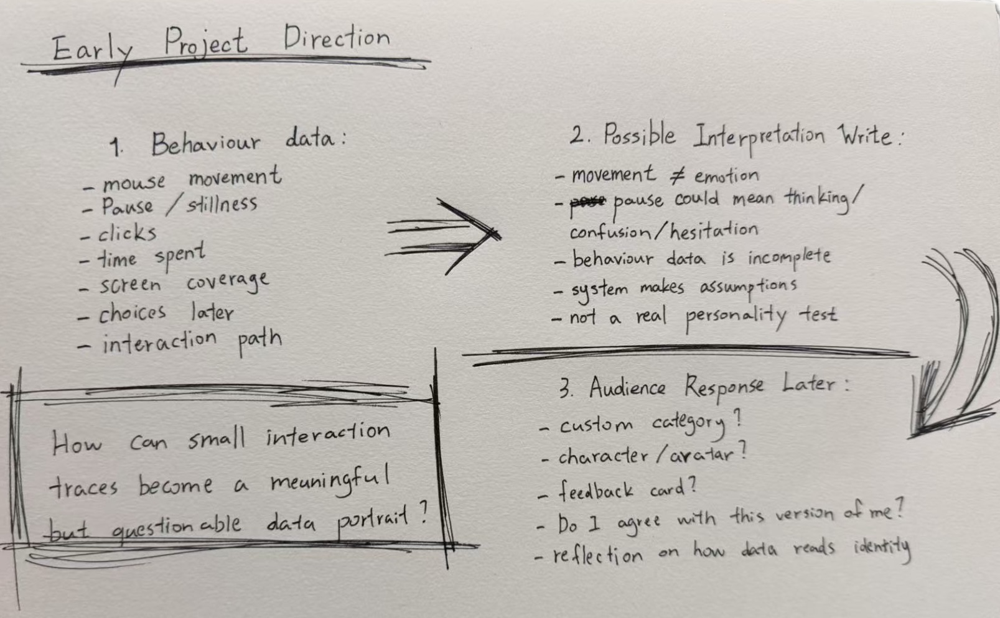
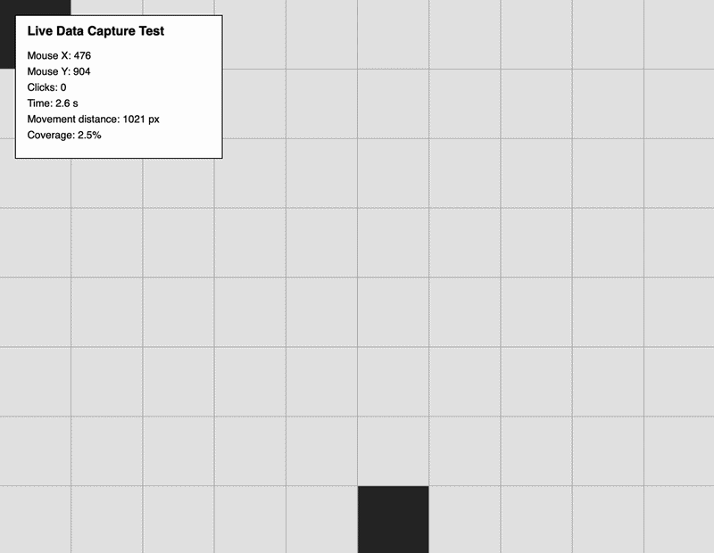
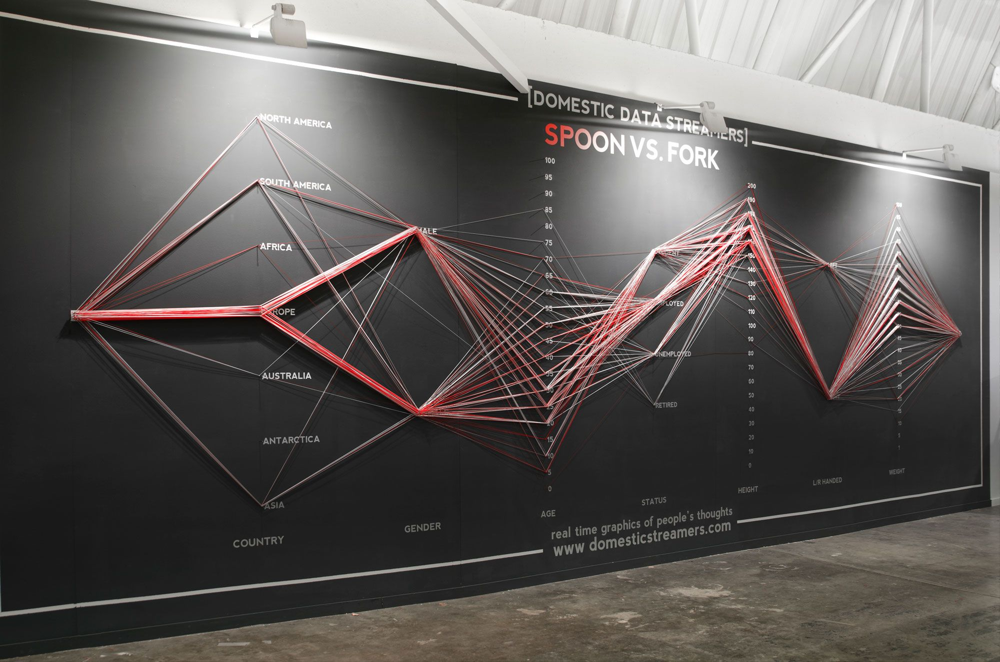
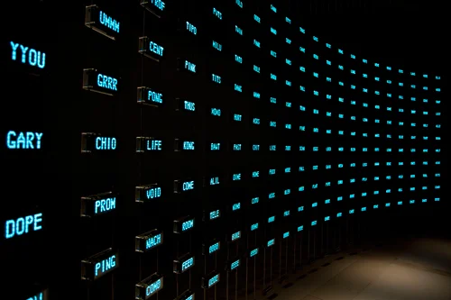
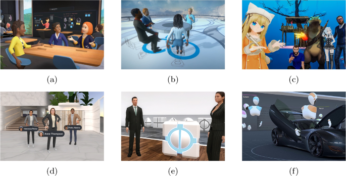
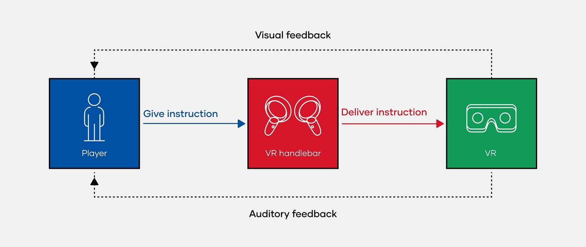

# Week 06 — Data-Driven Visualisation Development

[← Back to Home](../index.md)

# Interactive Data Mirror: Behaviour, Emotion, and Data Interpretation

## Overview

Week 06 marks the shift from the first phase of experiments into the Data-Driven Visualisation project. At this stage, the project is still in a planning and research phase. I am not trying to produce the final outcome yet. Instead, this week focuses on clarifying the project direction, identifying the data source, researching relevant precedents, planning the system, and testing one very small technical function.

My project direction is currently called **Interactive Data Mirror**. It explores how small audience behaviours, such as movement, pauses, clicks, choices, and hesitation, can become data. I am interested in how digital systems often interpret behaviour and then turn it into assumptions about emotion, personality, identity, or preference. Instead of treating this as a purely technical process, I want to question what happens when an audience is “read” by a system.

The final project may later develop into an interactive experience where the audience receives a custom character, category, or feedback based on their interaction data. However, for Week 06, this is only a future direction. This week is about building the foundation: What data could be collected? What does it mean? What are the limitations? What do I need to learn before making the final artefact?

 

---

# In-Class Activities

## 1. Data Exploration

### Project Data Clarification

After receiving proposal feedback, I realised that my project needed a clearer relationship between data, interaction, and audience meaning. My original idea was about emotional states, self-expression, live data, and game-like systems. These ideas were interesting, but they were also too broad. For the project to become feasible, I need to focus on one main data source and one clear design question.

The current project uses **audience interaction data** as the main data source. This means the data is generated during the audience’s experience with the work. Rather than using an existing public dataset, the project collects small behavioural traces created by the participant in real time.

The project currently focuses on two simple data types:

1. **Live movement data**  
   Mouse position, movement path, distance travelled, and screen coverage.

2. **Basic interaction data**  
   Clicks, time spent, pauses, and later possibly choices or repeated actions.

For Week 06, I only tested movement and coverage, because I want the technical work to stay simple. The more complex emotional/personality interpretation will be developed later, once the project direction is clearer.

  
[View the Test and Code](https://editor.p5js.org/Jeffcai0502/sketches/WzcK16fsP)

---

### 1.1 Data Source and Where It Comes From

The data source comes from the audience’s direct interaction with the screen. When a participant moves the mouse across the canvas, the system records the changing mouse position. This movement creates a path over time. The canvas is also divided into a simple grid, so the system can record which areas have been visited.

This creates a small dataset based on behaviour:

- current mouse position
- previous mouse position
- total distance moved
- number of clicks
- session time
- number of grid cells visited
- percentage of screen coverage

This data comes from the audience during the experience, so it is both personal and temporary. It is not a large dataset, and it does not claim to represent the whole person. It only captures a short moment of interaction.

I chose this kind of data because it connects directly to my project theme. Many digital systems collect behavioural traces in the background: how long we pause, where we click, what we ignore, how quickly we respond, and what path we take through an interface. These traces can then be used to make assumptions about us. My project begins by making this kind of trace visible.

  
*Figure 3. Placeholder for data source sketch.*

---

### 1.2 What the Data Contains and How It Is Structured

The Week 06 data structure is intentionally simple. I am only using data that can be captured clearly in p5.js without making the prototype too advanced too early.

| Data field | Type | Description | Possible meaning later |
| --- | --- | --- | --- |
| `mouseX` | number | current horizontal mouse position | location of attention |
| `mouseY` | number | current vertical mouse position | location of attention |
| `totalDistance` | number | estimated movement distance | activity level / motion intensity |
| `clickCount` | number | number of clicks during the session | direct interaction / decision points |
| `sessionTime` | number | time since the sketch started | duration of engagement |
| `visitedCells` | number | number of grid cells touched by the mouse | screen exploration |
| `coveragePercent` | number | percentage of total grid visited | how widely the user explored |

At this stage, I am avoiding interpretation such as “this person is confident” or “this person is anxious.” The data is only being observed and displayed. This is important because I want to build the project gradually. Week 06 should not jump straight into a final emotional-reading system. Instead, it should ask whether this kind of behavioural data is useful material for the project.

  
*Figure 4. Placeholder for data structure diagram.*

---

### 1.3 Limitations, Biases, and Gaps

The biggest limitation is that movement data is very shallow. It can show where a mouse moved, but it cannot explain why. A participant may move slowly because they are thinking, reading, confused, distracted, or simply using a trackpad. Wide movement across the canvas may suggest exploration, but it could also happen because the interface is unclear.

Another limitation is that the data depends on the device. A mouse, trackpad, touchscreen, or drawing tablet can all produce different movement patterns. This means the system may accidentally reflect device habits rather than emotional or behavioural states.

There are also accessibility concerns. Some people may move differently because of physical ability, comfort with computers, language confidence, or unfamiliarity with the interaction. Therefore, it would be inappropriate to treat the data as a direct measurement of personality or emotion.

These limitations are not only problems; they are part of the project’s critical meaning. The project is about how easily systems can interpret limited behavioural data. By beginning with simple movement data, I can see how much is missing and why the final project must communicate uncertainty, not certainty.

---

## 2. Visual Research and Precedent Study

This week, I gathered visual references that connect to interaction, personal data, data traces, emotional interpretation, and speculative digital systems. I focused on works that can help me think about the project as a meaningful audience experience rather than just a technical sketch.

---

### 2.1 Giorgia Lupi and Stefanie Posavec — *Dear Data*

  
*Figure 5. Placeholder for Dear Data reference image.*

**What draws me to it:**  
*Dear Data* transforms everyday personal observations into hand-drawn visual systems. I am drawn to the way the project makes small details of daily life feel meaningful. The data is not presented as cold statistics; it is intimate, imperfect, and connected to lived experience.

**What I might carry forward:**  
I want to carry forward the idea that small personal traces can become a kind of portrait. My project also begins with small traces, but instead of tracking habits by hand, I am looking at digital interaction traces such as movement and pause. The visual language of *Dear Data* reminds me that data does not have to look like a normal chart.

**How it affects my direction:**  
This reference reinforces my interest in data humanism. It helps me think about behaviour data as something that should feel personal and reflective, not just technical.

---

### 2.2 Domestic Data Streamers — Participatory Data Works

  
*Figure 6. Placeholder for Domestic Data Streamers reference image.*

**What draws me to it:**  
Domestic Data Streamers often create participatory works where audiences physically contribute to a data system. The viewer is not passive; their action becomes part of the work.

**What I might carry forward:**  
I want the audience to feel that they are producing the data, not only viewing it. This is important for my project because the data source comes directly from the participant’s behaviour. Even if my final work is screen-based, the audience’s movement and decisions should feel meaningful.

**How it affects my direction:**  
This reference makes me think more carefully about the participation flow. The project should not hide the fact that data is being collected. The audience should be able to understand that their interaction becomes the material of the work.

---

### 2.3 Mark Hansen and Ben Rubin — *Listening Post*

  
*Figure 7. Placeholder for Listening Post reference image.*

**What draws me to it:**  
*Listening Post* collects fragments from online conversations and turns them into a public installation. It feels poetic, but also slightly uncomfortable, because private digital traces become visible in a public form.

**What I might carry forward:**  
My project is not using online conversations, but it is also interested in digital traces. I want to create a similar tension where the audience is drawn into the experience, but then becomes aware that the system is reading them through limited data.

**How it affects my direction:**  
This precedent strengthens the critical side of the project. The final work should not only be visually attractive. It should also raise a question about surveillance, behavioural tracking, and how identity is constructed from fragments.

---

### 2.4 Rafael Lozano-Hemmer — *Pulse Room*

  
*Figure 8. Placeholder for Pulse Room reference image.*

**What draws me to it:**  
*Pulse Room* takes a participant’s heartbeat and turns it into a field of flashing light bulbs. A hidden bodily signal becomes visible, shared, and spatial.

**What I might carry forward:**  
I am interested in the transformation from invisible internal states to visible output. My project is not using heartbeat data, but it uses interaction behaviour as another kind of trace. The audience’s movement may become a visual record of their engagement.

**How it affects my direction:**  
This reinforces the idea that simple data can become powerful if the translation is clear. The final project does not need a large or complex dataset; it needs a strong relationship between input, transformation, and audience reflection.

---

### 2.5 Natalie Jeremijenko — *Dangling String*

  
*Figure 9. Placeholder for Dangling String reference image.*

**What draws me to it:**  
*Dangling String* makes internet traffic visible through a moving physical string. I am interested in how the work translates invisible digital activity into a calm, visible behaviour.

**What I might carry forward:**  
The project shows that data visualisation can be subtle. It does not need to explain everything through numbers. It can create an atmosphere that suggests the presence of unseen activity.

**How it affects my direction:**  
This is useful for my project because I am thinking about movement and coverage as behavioural traces. The final work could use subtle motion or visual accumulation rather than a direct chart.

---

### 2.6 Personality Tests, MBTI, and Custom Category Systems

  
*Figure 10. Placeholder for visual research collage.*

**What draws me to it:**  
Personality tests are popular because they give people a simplified language for describing themselves. They are often easy to share and emotionally satisfying, even when they are reductive or not fully scientific.

**What I might carry forward:**  
My project may later use custom categories inspired by this format. However, I do not want to simply copy MBTI or create a normal quiz. I want to make a category system that is clearly designed from interaction behaviour and invites the audience to question it.

**How it affects my direction:**  
This reference helps me think about the final audience gain. A custom category or character can give the audience something personal to take away. At the same time, the project can reveal how limited and constructed these identity systems are.

---

### 2.7 Game Systems and Behavioural Profiling

  
*Figure 11. Placeholder for game behaviour / player choice system reference.*

**What draws me to it:**  
Many games track player choices and use them to shape feedback, endings, or character alignment. I am interested in this because it shows how interaction can become a profile of the player.

**What I might carry forward:**  
I want to use the feeling of a game-like system, where the audience’s actions seem to matter. However, I want the project to stay reflective rather than purely entertaining.

**How it affects my direction:**  
This reinforces my plan to develop the project gradually. Week 06 only tests live capture and coverage. Later weeks can explore choice-based interaction, category design, and character feedback.

---

## 3. Project Planning and Skills Roadmap

### 3.1 What Do I Need to Make?

At this stage, the final artefact is still open. The current plan is to make a screen-based interactive experience for public display. The audience will interact with a digital space, and the system will collect simple behaviour data from that interaction. Later, this data may be transformed into a custom character, category, or feedback response.

The project currently has four possible layers:

1. **Interaction layer**  
   The audience moves, clicks, pauses, and possibly makes choices.

2. **Data capture layer**  
   The system records simple behavioural traces such as movement distance, coverage, clicks, and time.

3. **Visual response layer**  
   The system shows traces of the audience’s behaviour through movement, marks, coverage, or changing visual atmosphere.

4. **Reflection layer**  
   The audience is invited to think about how their behaviour has been translated into data and how that data might be interpreted.

For Week 06, I am only testing the first two layers. I do not want to build the final result yet because I still need space to develop the concept across the following weeks.

  
*Figure 12. Placeholder for initial system sketch.*

---

### Initial System Logic

The early system logic is:

> Audience movement → live data capture → movement coverage → visible trace → later interpretation

This is deliberately simple. It helps me test whether audience behaviour can become usable data before adding more complex ideas.

  
*Figure 13. Placeholder for simple system logic diagram.*

---

### Possible Final Direction

The possible final direction is:

> Audience behaviour → interaction profile → custom category → custom character → reflective feedback

However, this belongs to later development. In Week 06, I am only identifying this as a direction, not presenting it as a finished outcome.

The reason I am interested in this direction is that it gives the audience something meaningful to gain from the work. Instead of only seeing abstract visuals, the audience may later receive a personalised response that makes them ask:

- Why did the system read me this way?
- Do I agree with this version of myself?
- What parts of me are missing from the data?
- Is this a reflection, or an invention?

  
*Figure 14. Placeholder for future character/category idea sketch.*

---

### 3.2 What Do I Need to Learn?

#### 1. Basic p5.js Data Capture

My first priority is learning how to capture simple interaction data in p5.js. This includes mouse position, movement distance, clicks, time, and coverage. I need this because the audience’s behaviour is the main data source.

#### 2. Movement Coverage Mapping

I need to learn how to divide the canvas into a grid and record which areas the audience has visited. This gives me a very simple way to visualise exploration without creating a complex final system too early.

#### 3. Interaction Flow Design

I need to plan how the audience will enter, understand, and interact with the work. If the interaction is confusing, the data will not be meaningful. I need to design clear instructions and a simple flow.

#### 4. Data Interpretation Framework

Later, I need to decide how behaviour data could become categories or feedback. This is not a technical problem only. It is also conceptual, because the system must show that interpretation is partial and designed.

#### 5. Visual Language for Emotional Data

I need to research how shape, motion, density, rhythm, and atmosphere can suggest emotional qualities without becoming a normal chart. This will become more important in later weeks.

---

### 3.3 Next Steps

My next step is to keep the technical prototype very simple and use it only as a data collection test. I will create a p5.js sketch that tracks live mouse position, click count, session time, total movement distance, and movement coverage across a grid. I will screenshot the interface and use it as evidence of technical skill building, but I will not yet generate a personality category or final response.

Alongside this, I will continue developing the concept through sketches. I need to draw the audience journey more clearly: what the audience sees first, what they do, what data is captured, and how the system might respond later. I also need to keep researching references related to data humanism, digital traces, participatory data, and personality systems.

For Week 07, I plan to use peer feedback to evolve the concept sketch and begin making rough variations of the visual response. I want to test different possibilities before committing to a final product around Week 10.

---

# Independent Study

## 1. Consultation Reflection

During the proposal consultation, the most useful feedback was that my project needed a clearer focus and stronger audience meaning. My earlier proposal included emotional data, live data, AI, interaction, and game-like systems, but the relationship between these ideas was not specific enough. The feedback helped me realise that the project should not simply create abstract visuals from behaviour. It needs to show what the audience can learn from the system’s response.

After the consultation, I refined the project toward audience interaction data and digital identity interpretation. I decided to focus first on simple behavioural traces, such as movement, pauses, clicks, and coverage. This makes the project more practical and gives me a clearer data source. I also realised that the final work should not claim to accurately detect emotion. Instead, it should question how systems make assumptions from limited data. As a result, I will develop the project more slowly, beginning with basic live capture in Week 06 before exploring categories, characters, and feedback in later weeks.

  
*Figure 15. Placeholder for consultation notes.*

---

## 2. Technical Skill Building

This week, I addressed my first technical skill gap: capturing live interaction data in p5.js. I made a very simple sketch that tracks movement and coverage. The sketch does not produce a final result, interpretation, or personality category. Its purpose is only to test whether basic behavioural traces can be recorded and displayed.

The sketch records:

- current mouse X and Y position
- click count
- session time
- total movement distance
- number of visited grid cells
- percentage of canvas coverage

The visual output is also simple. The canvas contains a grid, and cells become darker when the mouse passes through them. A small information panel shows the live values updating in real time. This helps me understand how behaviour can become measurable without overdeveloping the final design too early.

  
*Figure 16. Placeholder for screenshot of the simple p5.js capture test.*

  
*Figure 17. Placeholder for movement coverage screenshot.*

Through this test, I learned that even very simple interaction data can produce a visible pattern. The coverage grid shows where attention and movement travelled across the interface. However, the test also shows that raw data does not automatically create meaning. It needs framing, interpretation, and visual design. This is why the next stage should focus on concept development rather than adding too many features immediately.

### p5.js Prototype Link

[Simple Live Data Capture — paste p5.js link here](https://editor.p5js.org/your-username/sketches/your-sketch-id)

---

## 3. Initial Concept Sketch

Building on the in-class planning diagram, I made an initial concept sketch for the project. The sketch does not show a final interface. Instead, it shows the possible relationship between the audience, the data capture system, and the future response.

The concept sketch includes:

1. **Audience interaction area**  
   A screen-based space where the participant moves and makes simple interactions.

2. **Live data capture layer**  
   A hidden or semi-visible layer that records movement, clicks, pauses, and coverage.

3. **Visual trace layer**  
   A visible layer that shows movement paths, density, or explored areas.

4. **Future interpretation layer**  
   A later system that may translate behaviour into a custom category or character.

5. **Audience reflection point**  
   A final moment where the audience considers how the system interpreted them.

  
*Figure 18. Placeholder for initial concept sketch.*

This sketch helped me identify that the project should not move too quickly toward a polished outcome. The main task now is to clarify the system and test each layer step by step. The final artefact will become stronger if the early weeks show careful planning, research, and reflection.

---

# Week 06 Reflection

Week 06 was important because it helped me slow the project down. Instead of trying to build the final product immediately, I focused on the foundation of the project: data source, visual research, system planning, and basic technical testing.

The most important decision this week was to use audience behaviour as the primary data source. This gives the project a clear relationship between interaction and data. However, I also learned that behaviour data is limited and unstable. Movement, clicks, and coverage can show traces of interaction, but they cannot fully explain emotion or identity.

This limitation actually makes the project more interesting. The final work can question the gap between data and personhood. It can show that digital systems may create convincing readings from very small traces, but those readings are always partial.

For the next week, I need to continue sketching, receive peer feedback, and test small visual variations. The final product should not be fixed yet. Week 06 establishes the research and planning needed for later development.

---

# References

Domestic Data Streamers. (n.d.). *Participatory data installations*. https://www.domesticdatastreamers.com

Hansen, M., & Rubin, B. (2002–2005). *Listening Post*.

Jeremijenko, N. (1995). *Dangling String*.

Lozano-Hemmer, R. (2006). *Pulse Room*.

Lupi, G., & Posavec, S. (2016). *Dear Data*.

Superflux. (n.d.). *Speculative design and experiential futures*. https://superflux.in

p5.js. (n.d.). *p5.js reference*. https://p5js.org/reference/

---

# AI Acknowledgement

I used ChatGPT to help organise this Week 06 journal entry, refine the writing, and simplify the p5.js technical test. The project direction, design intention, and final editing remain my own. AI assistance was used as part of my documented design workflow for writing, planning, and early code testing.
