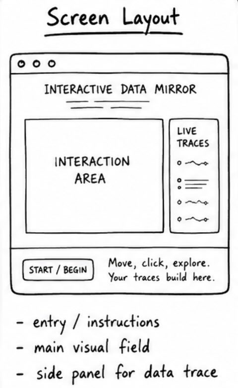
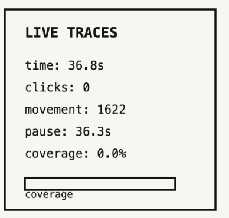
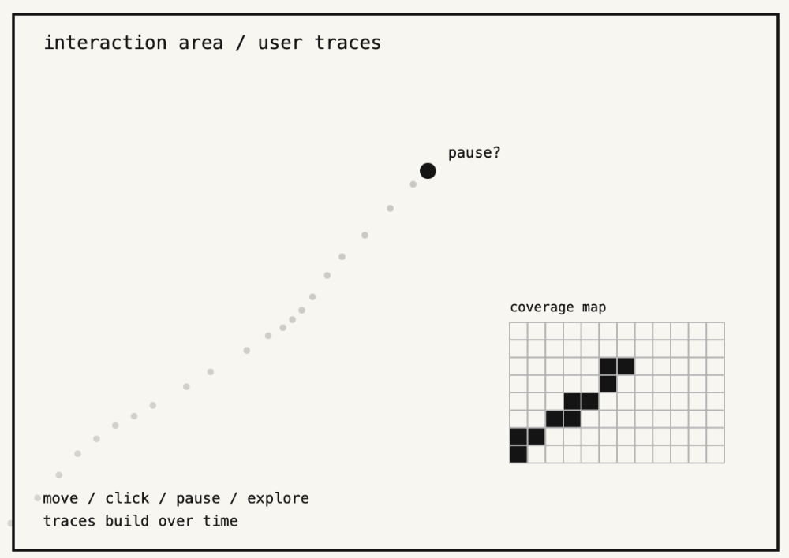

# Week 07 — Concept Development and Early Skill Building

[← Back to Home](../index.md)

# Interactive Data Mirror: Developing the Behaviour-to-Identity System

## Overview

Week 07 focused on developing the project through sketching, peer response, and small technical experiments. After Week 06, I had clarified that the project should not become a finished interactive system too quickly. This week, I focused on the structure of the experience: how the audience enters the work, how their behaviour becomes data, and how that data might later be translated into a reflective response.

The project is still called **Interactive Data Mirror**. It explores how a website or digital system can read small audience behaviours — movement, pauses, clicks, repeated actions, and choices — and convert them into a version of identity. The project does not aim to accurately diagnose personality or emotion. Instead, it questions how digital platforms already make assumptions from behavioural traces.

This week’s work developed the project in three directions:

1. refining the concept sketch and audience journey  
2. testing small p5.js code fragments for data capture  
3. exploring “what if” variations that could make the project more critical and meaningful

I am treating Week 07 as a testing and decision-making stage, where I can explore possible directions before committing to the final interaction and visual language later.

---

# In-Class Activities

## 1. Concept Sketches

This week, I further developed my concept sketch from Week 06. In the previous week, my diagram focused mainly on the overall system: audience movement becomes interaction data, and that data may later become a personalised response. For Week 07, I redrew the concept as a clearer audience journey.

The updated sketch has four main stages:

1. **Entry / Invitation**  
   The audience enters the website and is invited to “explore naturally.” The wording is important because the system should not feel like a test at first.

2. **Interaction Field**  
   The audience moves through a visual space. Their movement, pauses, clicks, and path are captured as live behavioural data.

3. **Data Trace Layer**  
   The system begins to show traces of interaction, such as movement coverage, density, repeated paths, or zones of attention.

4. **Future Reflection Layer**  
   Later in the project, this data may become a custom category, character, or feedback card. At this stage, this remains a planned direction rather than a completed output.

  

### Peer Feedback

After displaying my sketch, I received feedback from peers. The most useful comments were not about how the final website should look, but about what the audience should understand from it.

Some feedback I recorded:

- The idea of the system “reading” the audience through interaction was interesting.
- The connection between movement data and emotional interpretation needed to be clearer.
- The project should avoid feeling like a normal personality quiz.
- The audience should be able to see that the system’s interpretation is incomplete.
- The final response should feel personal, but also slightly questionable.

One peer asked an important question:

> “If the system gives people a category, how will they know it is not meant to be completely true?”

This question helped me realise that the final artefact needs to include a visible reflection moment. If the audience only receives a category or character, the project may become too similar to a personality test. The stronger direction is to show how the result was made and invite the audience to question it.

### Development After Feedback

Based on the feedback, I made three changes to my project direction:

1. **The result should not appear as objective truth**  
   Any future category or character must be described as a “system reading,” not a real diagnosis.

2. **The data trace should be visible before the result**  
   The audience should see some evidence of their movement, coverage, or interaction pattern before receiving a personalised response.

3. **Reflection should be part of the interface**  
   The final website should ask the audience whether they agree with the system’s reading and what might be missing.

This shifted the project from a simple interactive visualisation toward a more critical experience about data interpretation.

---

## 2. Making Sprint

For the Making Sprint, I did not try to create a finished website. Instead, I focused on small technical tests that could support the project later. The main question was:

> What basic interaction behaviours can p5.js capture, and how might these become useful design material?

I tested small code fragments rather than a complete product. This helped me keep the project at an appropriate Week 07 stage. I wanted to understand the building blocks before adding more complex visual or emotional systems.

---

### 2.1 Tracking Clicks

The first test was counting mouse clicks. Clicks are useful because they can represent moments of direct action or decision-making. In a later version, clicks may help show how actively the audience engages with the website.

```javascript
let clickCount = 0;

function mousePressed() {
  clickCount = clickCount + 1;
}
```

This is a very simple fragment, but it helped me think about how small actions can become data. A click is not just a click inside this project; it can become a trace of attention, decision, or interaction intensity.

However, I also recognised that click count is limited. More clicks do not automatically mean more confidence or more interest. It could also mean confusion. This reinforces the critical side of the project: behavioural data always needs interpretation, and interpretation can be wrong.

  

---

### 2.2 Tracking Time Spent

The second test was session time. Time spent in the experience could later help measure engagement or hesitation.

```javascript
let startTime;

function setup() {
  createCanvas(600, 400);
  startTime = millis();
}

function draw() {
  let seconds = (millis() - startTime) / 1000;
  text("Time: " + nf(seconds, 1, 1), 20, 30);
}
```

This test was useful because time is one of the simplest forms of behavioural data. It can show how long the audience stays with the system. However, like click count, time does not have a fixed meaning. A long time could mean interest, confusion, careful reading, or distraction.

For this reason, I do not want the final work to treat time as a direct emotional measurement. Instead, it should be one small part of a broader interaction profile.

---

### 2.3 Movement Coverage Grid

The most useful making sprint test was movement coverage. I divided the canvas into a grid and marked cells as “visited” when the mouse moved through them. This created a simple visual map of where the audience had explored.

```javascript
let cols = 10;
let rows = 6;
let visited = [];

function setup() {
  createCanvas(600, 360);

  for (let i = 0; i < cols; i++) {
    visited[i] = [];
    for (let j = 0; j < rows; j++) {
      visited[i][j] = false;
    }
  }
}

function draw() {
  let cellX = floor(map(mouseX, 0, width, 0, cols));
  let cellY = floor(map(mouseY, 0, height, 0, rows));

  cellX = constrain(cellX, 0, cols - 1);
  cellY = constrain(cellY, 0, rows - 1);

  visited[cellX][cellY] = true;
}
```

This test felt most connected to the project because it creates a visible behavioural trace. The audience’s movement gradually leaves evidence on the screen. This supports the idea of a “data mirror,” where the system reflects back a pattern created by the audience’s own interaction.

  

---

### 2.4 Detecting Stillness or Pauses

I also tested how the system might detect stillness. Pauses are important to the concept because they may suggest hesitation, reflection, or uncertainty. However, I want to be careful not to over-interpret them too early.

```javascript
let pauseTime = 0;
let lastX;
let lastY;

function setup() {
  createCanvas(600, 400);
  lastX = mouseX;
  lastY = mouseY;
}

function draw() {
  let movement = dist(mouseX, mouseY, lastX, lastY);

  if (movement < 1) {
    pauseTime = pauseTime + deltaTime;
  }

  lastX = mouseX;
  lastY = mouseY;
}
```

This code fragment helped me understand how pause data might be collected. It also raised an important conceptual issue. A pause is ambiguous. It could mean thoughtfulness, but it could also mean that the audience looked away or stopped interacting. This ambiguity is important and should remain visible in the final project.

---

### Making Sprint Reflection

The Making Sprint helped me understand that the technical foundation of the project can stay simple. I do not need complex machine learning or a large dataset to begin exploring the idea. Small interaction traces are enough to start asking meaningful questions about behavioural data.

The main learning was that **capturing data is easy, but deciding what it means is difficult**. This is exactly the issue my project wants to explore. The final work should not hide the interpretation process. It should show that the system is making assumptions.

---

## 3. “What If” Variations

During the “What if” activity, I shared my project direction with a peer and explained the current system: a website captures audience behaviour and may later generate a personalised response. My peer suggested several possible variations that challenged me to think beyond the obvious version of the project.

### Variation 1: What if the system refused to categorise the user?

Instead of giving the audience a clear personality result, the system could say that the data is too incomplete to define them. This would make the project more critical because it resists the common digital tendency to categorise people quickly.

This idea is interesting because it questions the authority of the system. However, it may also reduce the audience’s sense of reward. If the system gives no response, the experience might feel unfinished.

---

### Variation 2: What if the audience could correct the system?

The system could first produce a reading, then allow the audience to respond: “accurate,” “partly true,” or “not me.” This correction could become another layer of data. The final visualisation would then show the gap between system interpretation and self-understanding.

This was the most useful variation because it makes the audience more active. They do not simply receive the system’s judgement; they can challenge it.


---

### Variation 3: What if the result was a character, not a score?

Instead of showing numbers or charts, the system could generate a character/avatar from the interaction data. Different behaviours could affect the character’s shape, movement, expression, or atmosphere.

This variation connects well with my interest in game systems and identity. It gives the audience something more emotional and memorable than a chart. However, it should still include explanation so the character does not feel random.

---

### Chosen Variation

The variation I want to carry forward is:

> **What if the audience could correct the system?**

This idea strengthens the project because it makes the interpretation process visible. The system reads the audience, but the audience can also read the system back. This creates a more critical relationship between data and identity.

In later weeks, I want to explore a feedback loop where the audience can compare the system’s interpretation with their own self-perception. This could become one of the most important parts of the final website.

---

# Independent Study

## 1. Project Development & Skill Building

For independent study, I continued developing the project based on the concept sketch, making sprint, and “what if” variations. I focused on skill building rather than producing a polished prototype.

The main technical skills I worked on were:

- storing simple interaction values in variables
- using `millis()` to measure time
- using `mouseX` and `mouseY` as live data
- creating a grid system for movement coverage
- thinking about how raw data might later become a visual response

### Skill 1: Using Variables as Data Containers

A key learning this week was that variables are the foundation of the project. Every interaction trace needs somewhere to be stored.

```javascript
let clickCount = 0;
let totalDistance = 0;
let pauseTime = 0;
```

These variables act like small containers for behavioural data. This connects to the project concept because the website is not just displaying visuals. It is recording and accumulating traces of the audience’s actions.

---

### Skill 2: Mapping Data to Visual Properties

I also tested how a data value could affect a visual property. For example, movement distance could change the size of a circle.

```javascript
let circleSize = map(totalDistance, 0, 5000, 20, 200);
circle(width / 2, height / 2, circleSize);
```

This is not a final visual design, but it helped me understand the basic logic of data mapping. A number can be translated into size, colour, speed, density, or motion. Later, this logic may help me create the custom character or emotional atmosphere.

---

### Skill 3: Thinking Critically About Mapping

The most important learning was not just technical. I realised that every mapping decision carries meaning. If I map “more movement” to “larger shape,” I am suggesting that activity takes up more visual space. If I map “pause time” to darkness, I may imply that stillness is heavy or hidden. These choices are design decisions, not neutral facts.

This is important because the project is about data representation. The final work should make the audience aware that data does not speak by itself. It is translated through design choices.

---

## 2. Progress Report Summary

For next week’s progress report, I organised my current project direction into a short presentation structure. The goal is to explain where the project currently stands and receive feedback before developing it further.

### Current Project Direction

**Interactive Data Mirror** is a website-based data visualisation that uses audience interaction data to explore how digital systems interpret behaviour. The project begins with simple traces such as movement, clicks, pauses, and coverage. These traces may later become a custom character, category, or feedback response.

  
[View the Test and Code](https://editor.p5js.org/Jeffcai0502/sketches/9yfSe62u7)

### Key Developments So Far

- I clarified that the project is about behavioural interpretation, not accurate emotion detection.
- I decided to use audience interaction data as the main data source.
- I tested simple p5.js code for movement coverage, click count, time, and pause detection.
- I identified the need for a visible reflection or correction moment.
- I am considering a final system where the audience receives a personalised result but can question or correct it.

### Visual Research / References

The references most relevant to my direction are:

- *Dear Data* — personal and human-centred data traces
- Domestic Data Streamers — participatory data systems
- *Listening Post* — digital traces made public
- *Pulse Room* — invisible signals made visible
- personality tests and game profiling systems — simplified identity categories

### Questions for Feedback

1. Does the project feel more meaningful if the system gives a custom category, or if it shows uncertainty instead?
2. Should the final response be more like a character, a feedback card, or a visual atmosphere?
3. How can I make the audience understand that the system’s reading is designed and limited, not objectively true?


---

# Week 07 Reflection

Week 07 helped me develop the project without moving too quickly into a final outcome. The concept sketch activity made me realise that the audience journey needs to be clearer. The audience should understand that their behaviour is becoming data, but they should not feel that the system has complete authority over them.

The Making Sprint helped me test the technical foundation of the project. Simple code fragments for clicks, time, coverage, and pauses showed that behaviour can be captured in p5.js. However, the larger design challenge is not technical capture but interpretation. The project becomes more interesting when I ask what these traces can and cannot say about a person.

The “What if” activity was especially useful because it introduced the idea of audience correction. If the system gives a reading, the audience might respond to it, challenge it, or reject it. This could make the final experience more reflective and less like a normal personality quiz.

Going forward, I want to develop the visual language of the project while keeping the critical question clear: **How do digital systems turn behaviour into identity, and how can audiences question that process?**

---

# References

Domestic Data Streamers. (n.d.). *Participatory data installations*. https://www.domesticdatastreamers.com

Hansen, M., & Rubin, B. (2002–2005). *Listening Post*.

Lozano-Hemmer, R. (2006). *Pulse Room*.

Lupi, G., & Posavec, S. (2016). *Dear Data*.

p5.js. (n.d.). *p5.js reference*. https://p5js.org/reference/

---

# AI Acknowledgement

I used ChatGPT to help organise this Week 07 journal entry, refine the written reflection, and produce short p5.js code examples for documenting technical skill building. I edited the content to match my project direction and used the AI assistance as part of my design documentation workflow.
