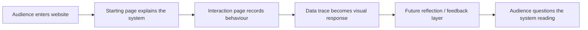

# Week 08 — Progress Report, Critical Proposition, and Starting Page Development

[← Back to Home](../index.md)
# Interactive Data Mirror: Designing the Entry Experience

## Overview

Week 08 focused on turning the project direction into a clearer design pathway. The final artefact is **not finished yet** and is not expected to be finished at this stage. Instead, this week I focused on clarifying the audience journey, making small design decisions, and building the **starting page** of the website before the interaction section.

The project is still titled **Interactive Data Mirror**. It is a web-based data visualisation that explores how audience behaviour can become data. The final experience will eventually collect interaction traces such as movement, clicks, pauses, choices, and time spent, then translate them into a personalised but questionable interpretation. However, this week I deliberately avoided building the full interaction system. I only developed the opening page because the first impression of the website will shape how the audience understands the whole project.

The key question for Week 08 was:

> How can the starting page prepare the audience to understand that their behaviour will become data, without making the work feel too much like a normal personality quiz?

This week’s development included:

| Area | Week 08 focus | Status |
| --- | --- | --- |
| Concept | Clarify audience journey and critical direction | In progress |
| Interface | Design starting page and entry instructions | Started |
| Interaction | Keep as placeholder only | Not built yet |
| Reflection | Plan future feedback/correction layer | Planned |
| Visual style | Test calm, slightly clinical, website-like layout | In progress |
| Documentation | Record design choices, code thinking, and next steps | Completed for this week |

---

# Class Activities

## 1. Progress Report Summary

For the progress report, I explained the project as a developing website experience rather than a finished artwork. My current direction is to create a system where the audience enters a digital space, interacts naturally, and later receives a response based on their behaviour data.

The project has become clearer since Week 06 and Week 07. In Week 06, I focused on data source and planning. In Week 07, I tested rough interaction traces, movement coverage, and a possible reflection layer. For Week 08, I moved from technical testing toward **interface framing**.

### Current Project Direction

**Interactive Data Mirror** asks how digital systems interpret people through behaviour. Instead of directly asking the audience how they feel, the system records small interaction traces. These traces may later become a custom profile, category, character, or feedback card.

The work is not trying to prove that behaviour data can accurately understand emotion. Instead, it shows how limited data can still produce a convincing reading of a person.

### Progress Report Talking Points

| Topic | What I presented |
| --- | --- |
| Main idea | A website that turns audience behaviour into a data portrait |
| Data source | Mouse movement, clicks, pauses, timing, screen coverage, choices |
| Future scenario | Digital systems increasingly infer identity and emotion from behaviour |
| Critical concern | Behaviour data is partial, but platforms often treat it as meaningful |
| Current stage | Starting page and audience framing |
| Next step | Build the interaction page and later reflection result |

### Progress Report Diagram



This diagram helped me explain that the project is not just a technical sketch. It is an experience with a beginning, middle, and reflective ending. The starting page becomes important because it sets the context before data collection begins.

---

## 2. Critical Design Proposition

For the critical design proposition, I developed a clearer argument for the project. The proposition is not just “make an interactive data visualisation.” It is about questioning the authority of behavioural data.

### Proposition

> **What if a website could read you through your smallest actions — but the result revealed more about the system’s assumptions than about you?**

This proposition helps position the project as both playful and critical. The audience may enjoy seeing a personal response, but the work also asks them to question the interpretation.

### Critical Position

Many digital systems already collect behavioural traces such as clicks, scrolls, pauses, view time, movement, and repeated choices. These traces are often used to predict interests, emotions, preferences, attention, or identity. The problem is that these readings can feel invisible and authoritative. The user rarely sees how the interpretation is made.

My project makes this process visible. It treats interaction data as a material for visualisation, but also shows that data interpretation is designed, selective, and incomplete.

### Critical Design Proposition Table

| Design proposition | What it questions | How it affects the project |
| --- | --- | --- |
| A system reads the audience through behaviour | Can behaviour represent identity? | The data source becomes mouse movement, clicks, pauses, and choices |
| The system gives a personalised response | Why do personalised systems feel convincing? | The final output may include a character, category, or profile |
| The response is visibly partial | What does data leave out? | The feedback layer must show uncertainty, not just confidence |
| The audience can respond back | Can users challenge algorithmic readings? | A future correction/reflection step may be added |

### Design Tension

| Playful side | Critical side |
| --- | --- |
| The audience receives a personal result | The result is based on limited traces |
| The system feels responsive | The system may misunderstand the audience |
| The website feels like a mirror | The mirror is designed by rules and assumptions |
| The output may be visually appealing | The interpretation should still feel questionable |

The key design challenge is to balance these two sides. If the work is too playful, it becomes a personality quiz. If it is too critical, it may feel dry or didactic. The final artefact needs to sit between these two modes.

---

# Independent Study

## 1. Project Development

### Why I Focused on the Starting Page

This week, I decided to develop the **starting page** first. I made this decision because the start of the website controls how the audience frames the whole experience. If the starting page feels like a game, the audience may treat the result as entertainment. If it feels too serious, they may become uncomfortable or overly cautious.

The starting page needs to do three things:

1. introduce the project clearly  
2. explain that interaction behaviour will become data  
3. create curiosity without revealing the final result too early  

I want the audience to understand that the system is watching interaction traces, but I do not want to explain every detail at the beginning. The starting page should create a mood of curiosity and slight uncertainty.

### Starting Page Content Plan

| Starting page element | Purpose | Design decision |
| --- | --- | --- |
| Project title | Identifies the work | Large, simple, centred |
| Short description | Explains the experience | “This website reads small interaction traces” |
| Data notice | Makes data collection visible | List movement, clicks, pauses, time |
| Start button | Moves audience into the interaction | Clear but not too playful |
| Background motion | Suggests hidden data traces | Slow drifting dots |
| Status line | Makes the system feel alive | Text such as “waiting for interaction” |

### Interface Hierarchy

```text
Interactive Data Mirror
↓
Short project explanation
↓
What the system will observe
↓
Start / Begin button
↓
Interaction page placeholder
```

The interaction page is not developed yet. In the Week 08 prototype, pressing the start button only moves to a placeholder page. This is intentional because the Week 08 focus is the entry experience, not the final interaction.

---

## 2. Design Choices

### Visual Style

I chose a simple monochrome visual style for this stage. The background is off-white, and the interface uses black lines and simple typography. This connects to the earlier sketch-like diagrams while also making the website feel clean and direct.

The current style is not the final style. It is a working visual direction for the starting page.

| Design aspect | Current choice | Reason |
| --- | --- | --- |
| Colour | Off-white background, black text | Simple, readable, process-focused |
| Typography | Monospace style | Suggests system, data, and interface |
| Layout | Central title with side data cards | Makes the page feel like a digital system |
| Motion | Slow drifting particles | Suggests invisible traces before interaction |
| Button | Simple outlined rectangle | Keeps the experience calm, not game-like |

### Information Design

The starting page needs to give enough information without becoming too text-heavy. I tested a structure where the audience sees a short explanation and three “trace cards.”

| Trace card | Meaning |
| --- | --- |
| Movement | The system will notice where the audience moves |
| Pause | The system will notice stillness and hesitation |
| Click | The system will notice direct actions and choices |

These cards help the audience understand the data source before interacting.

### Tone of Voice

The writing on the starting page should avoid sounding like a psychological test. I avoided phrases like “discover your true personality” because that would make the work feel too certain. Instead, I used more careful wording:

| Avoid | Use instead |
| --- | --- |
| “Find out who you really are” | “See how a system reads your traces” |
| “Your personality result” | “A possible interpretation” |
| “Accurate emotional profile” | “A partial data mirror” |
| “The system knows you” | “The system makes a reading” |

This supports the critical direction of the project.

---

## 3. Technical Development

This week’s p5.js development focused only on the starting page and placeholder navigation. The prototype is still a work in progress. It does not yet collect full interaction data or generate a final response.

### Features Built This Week

| Feature | Built? | Notes |
| --- | --- | --- |
| Start screen | Yes | Main focus of Week 08 |
| Animated background traces | Yes | Simple drifting dots |
| Trace cards | Yes | Explain movement, pause, click |
| Start button | Yes | Changes to placeholder page |
| Interaction page | Placeholder only | No real interaction logic yet |
| Result page | No | Reserved for later weeks |
| Character/category system | No | Reserved for later weeks |

### Code Structure

The code uses a simple `screenState` variable to control which part of the prototype is displayed.

```javascript
let screenState = "start";

function draw() {
  if (screenState === "start") {
    drawStartPage();
  }

  if (screenState === "interaction") {
    drawInteractionPlaceholder();
  }
}
```

This is a small but important technical decision. It means the project can later grow into multiple website stages without rewriting the whole sketch.

### Button Interaction

The start button checks whether the mouse is inside a rectangle. If it is clicked, the prototype changes from the start page to the interaction placeholder.

```javascript
function mousePressed() {
  if (screenState === "start") {
    if (overStartButton()) {
      screenState = "interaction";
    }
  }
}
```

This is not visually complex, but it creates the basic navigation structure for the website.

### Animated Trace Background

I used a small array of particles to create a slow animated background. The particles are not the actual data yet. They are a visual metaphor for traces waiting to be collected.

```javascript
for (let p of particles) {
  p.x += p.vx;
  p.y += p.vy;
  circle(p.x, p.y, p.size);
}
```

This helped the starting page feel less static while still keeping the interaction system unfinished.

---

## 4. Development Graphs and Tables

### Project Progress by Layer

| Layer | Week 06 | Week 07 | Week 08 | Later |
| --- | --- | --- | --- | --- |
| Data source | Defined | Tested roughly | Refined | Expand |
| Concept sketch | Initial | Developed | Reframed | Finalise |
| Start page | Not started | Rough idea | Built WIP | Polish |
| Interaction page | Simple test | Janky WIP | Placeholder | Build |
| Reflection layer | Future idea | Sketched | Planned | Build |
| Final artefact | Not started | Not started | Not started | Week 10–11 |

### Development Priority Graph

```text
Concept clarity        ████████░░  80%
Starting page          ██████░░░░  60%
Interaction logic      ███░░░░░░░  30%
Reflection layer       ██░░░░░░░░  20%
Final visual polish    █░░░░░░░░░  10%
```

This graph makes the current stage clearer. The project is conceptually becoming more focused, but the final interaction and visual polish are still intentionally unfinished.

### Risk / Response Table

| Risk | Why it matters | Current response |
| --- | --- | --- |
| It feels like a personality quiz | The project may lose critical depth | Use careful language and show uncertainty |
| Audience does not know what to do | Interaction data may be meaningless | Start page explains movement/click/pause |
| Too much technical complexity too early | Leaves no room for later development | Build start page only this week |
| Data interpretation feels too objective | Could misrepresent emotion/identity | Future response will say the reading is partial |
| Website feels visually plain | Audience may not engage | Add subtle motion and clean interface structure |

---

## 5. Reflective Summary (~300 words)

This week helped me understand that the project needs a strong entry experience before the interaction becomes meaningful. In earlier weeks, I was focused on how to capture movement, clicks, pause time, and screen coverage. These technical tests were useful, but they did not yet explain why the audience should care. For Week 08, I focused on the starting page because it sets the tone for the whole visualisation.

The main decision was to make the starting page clear but slightly uncertain. I want the audience to understand that the system will observe their behaviour, but I do not want the work to feel like a normal personality quiz. This is why I avoided language that promises accuracy. Instead, the starting page describes the system as creating a “possible reading” from interaction traces.

The critical design proposition also became clearer this week. The project is not about proving that data can understand emotion. It is about showing how digital systems can turn small actions into assumptions about identity. This means the final work needs to be both engaging and uncomfortable. The audience should receive something personal, but they should also question whether the system has misunderstood them.

Technically, I kept the prototype simple. I built the start screen, animated trace background, trace cards, and a start button that leads to a placeholder interaction page. This felt like the right amount of progress for Week 08 because the final artefact does not need to be completed yet. The interaction page, character system, and reflection layer can be developed in later weeks.

Going forward, I need to build the interaction page more carefully. The next stage is to decide how the audience’s movement and clicks will become visible traces, and how those traces will eventually connect to the reflection layer.

---

# Week 08 p5.js Prototype

[Week 08 Starting Page Prototype — paste your live p5.js / GitHub Pages link here](https://editor.p5js.org/your-username/sketches/your-sketch-id)

  
*Week 08 progress GIF. The prototype currently focuses on the start page and leaves the interaction page as a placeholder for later development.*

---

# Short Caption for Website Link

The Week 08 prototype develops the opening screen of **Interactive Data Mirror**. It introduces the project, explains the behaviour traces that may be observed, and tests the visual tone of a website that reads audience interaction data. The interaction page is intentionally left as a placeholder because the focus this week is the entry experience and audience framing.

---

# AI Acknowledgement

I used ChatGPT to help structure this Week 08 journal entry, refine the critical design proposition, create documentation tables, and support the p5.js starting page prototype. I edited the content to match my own project direction and used AI as part of my documented design workflow.
