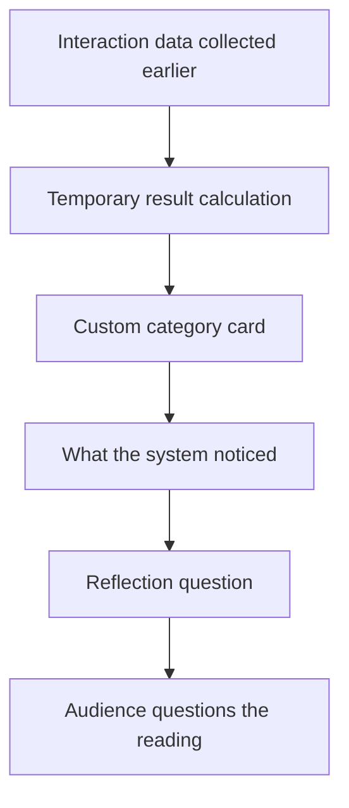
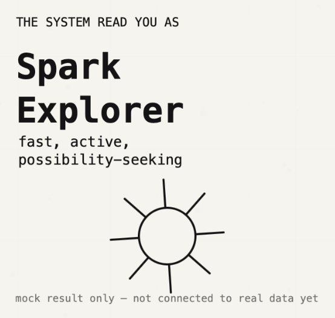
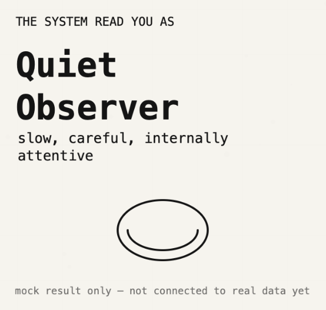
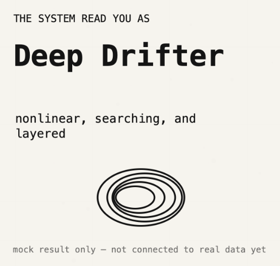
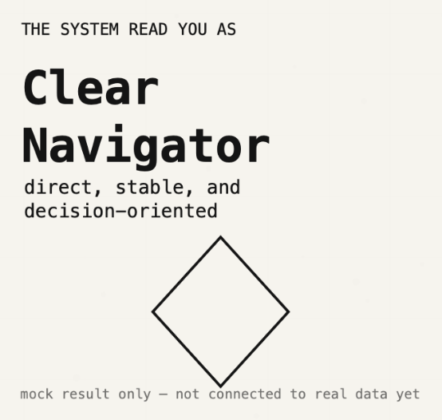
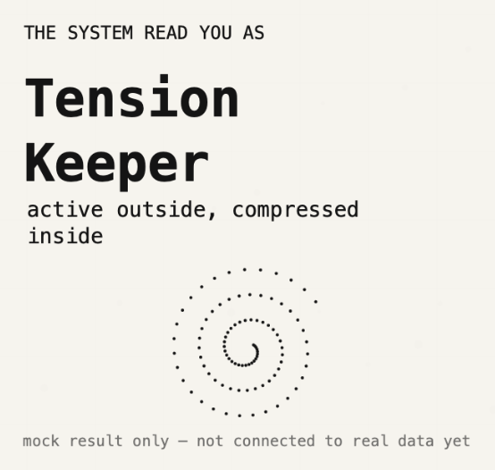
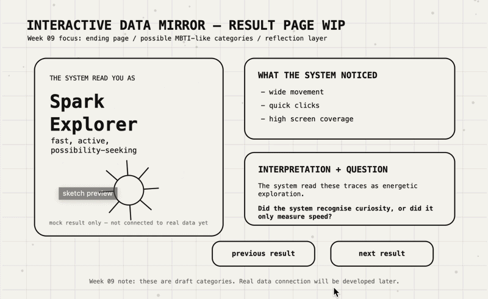

# Week 09 — Project Statement Draft, Rapid Reactions, and Ending Page Development

[← Back to Home](../index.md)


# Interactive Data Mirror: Designing the Ending / Reflection Page

## Overview

Week 09 focused on clarifying the public-facing explanation of the project and developing the **ending page** of the website. The final artefact is still not complete. The full interaction system, data capture, and final visual response will continue to develop across Week 10 and Week 11. For this week, I focused on what happens **after** the audience interacts with the system.

In Week 08, I developed the starting page. That page introduced the project and explained that the website would observe small behavioural traces such as movement, clicks, pauses, and time spent. For Week 09, I began designing the possible ending state: the page where the audience receives a system-generated “reading” of themselves.

This ending page is important because it is where the project’s meaning becomes clearest. The audience should not just see a random result. They should understand that the system has interpreted them through limited data and that this interpretation is partial, designed, and open to disagreement.

The key question for Week 09 was:

> How can the ending page give the audience a personalised result while still making them question whether the system really understands them?

The current direction is to create several custom audience categories inspired by MBTI-style personality results, but specific to this project. These categories are not scientific personality types. They are playful, speculative interpretations based on interaction behaviour.

---

# Week 09 Checklist

| Required area | How I addressed it this week | Status |
| --- | --- | --- |
| Project Statement: First Draft | Wrote a public-facing statement for the final website | Drafted |
| Round Robin Rapid Reactions | Reflected on likely feedback and clarified response direction | Documented |
| Project Development | Developed ending page / possible result screen | In progress |
| Progress Report Summary | Organised current project state and next steps | Completed |
| Final artefact | Not finished yet; still planned for Week 11 | Not final |

---

# In-Class Activities

## 1. Project Statement: First Draft

This week I drafted the project statement for **Interactive Data Mirror**. The statement needs to work as a wall text or website introduction for a public audience. It should explain what the visualisation is, what data it uses, what future scenario it responds to, and what impact I want it to have.

### Draft Project Statement

> **Interactive Data Mirror** is a web-based data visualisation that invites audiences to explore how their behaviour can be translated into a personalised digital identity. Instead of asking users to directly describe who they are or how they feel, the website observes small interaction traces: mouse movement, clicks, pauses, choices, time spent, movement coverage, and the paths users take through the interface. These behaviours become the data source for the work.
>
> The visualisation transforms this live interaction data into a custom audience profile, including a generated category, character direction, and reflective feedback. These results are inspired by familiar systems such as personality tests, game profiles, and recommendation algorithms, but they are designed to be questioned rather than accepted as truth. The work asks: when a system reads our behaviour, is it understanding us, simplifying us, or inventing a version of us?
>
> The subject of this project is emotional self-expression in everyday digital life. In a near-future scenario, websites, apps, games, and online platforms increasingly interpret users through behavioural patterns rather than direct communication. A pause, a click, or a repeated movement may become evidence of personality, emotion, uncertainty, or desire. This project makes that hidden process visible.
>
> Critically, **Interactive Data Mirror** does not claim that data can fully understand a person. Instead, it shows the gap between lived experience and data representation. The audience receives a result that may feel personal, playful, accurate, or uncomfortable, but the feedback also reveals the limits of the system’s interpretation.
>
> The intended impact is to help audiences reflect on how digital systems collect, interpret, and represent them. By turning interaction data into a mirror, the work encourages people to question what parts of themselves can be captured by data, and what remains invisible.

### Statement Evaluation

| Question | Evaluation |
| --- | --- |
| What is working well? | The statement clearly explains the project as a web-based visualisation and identifies audience interaction data as the source. It also explains that the final result is not meant to be objectively true. |
| What is missing? | The statement could later become more specific about the final interface and exact categories once the interaction page is developed. |
| What feels too general? | Phrases like “digital identity” and “data representation” are useful, but they need to stay connected to actual interface decisions. |
| What needs further development? | The relationship between interaction behaviour and each result category needs to be tested and explained more clearly. |

### One-Sentence Commitment

> I aim to create a web-based data mirror that turns audience interaction traces into a personalised but questionable identity reading, helping people reflect on how digital systems interpret them.

---

## 2. Round Robin Rapid Reactions

For the Round Robin Rapid Reactions stage, I shared the direction of the project statement and the Week 09 ending-page idea. The discussion focused on whether the audience result should feel like a game, a personality test, or a critical reflection tool.

I recorded the feedback as themes rather than exact quotes because the project is still in development.

### Rapid Reaction Notes

| Feedback theme | What I understood | Design response |
| --- | --- | --- |
| The “MBTI-like” idea is easy to understand | Familiar category systems help audiences quickly understand the result | Keep categories, but make them custom to the project |
| The result should not feel too serious | If the result feels like diagnosis, it becomes ethically risky | Use playful wording and visible uncertainty |
| The audience needs to know what data created the result | Otherwise the result may feel random | Add “What the system noticed” section |
| The project should keep a critical edge | A normal personality quiz would be too simple | Include reflection question and “not a truth” statement |
| The ending page should feel rewarding | The audience needs something to receive after interacting | Give a clear category/result card |

### Key Decision From Reactions

The most useful insight was that the ending page needs to do two things at the same time:

1. **Reward the audience** with a personal result.
2. **Challenge the audience** by showing that the result is only a system interpretation.

This led me to structure the ending page around three sections:

| Ending page section | Purpose |
| --- | --- |
| Category result | Gives the audience a memorable identity-like response |
| System noticed | Shows the data traces behind the result |
| Reflection prompt | Encourages critical thinking and disagreement |

---

# Independent Study

## 1. Project Development — Ending Page

### Why I Focused on the Ending Page

After developing the starting page in Week 08, I decided to focus on the ending page in Week 09. I deliberately did **not** develop the main interaction page this week. This is because the starting and ending pages define the conceptual frame of the project. The interaction page can be built more effectively once I know what kind of result it needs to produce.

The ending page is where the audience sees the consequence of being interpreted by the system. If this page is too playful, the project may become a normal personality test. If it is too critical, the audience may not feel engaged. I therefore designed the ending page as a hybrid between a personality result card and a reflection interface.

### Ending Page Structure



For this week’s p5.js prototype, the interaction data is not fully connected yet. Instead, I built a test ending page with mock result categories. This allows me to test the layout, language, and interaction logic before connecting it to real behavioural data later.

---

## 2. Custom Category System

The result categories are inspired by MBTI-style profiles, but they are not copied from MBTI. They are custom categories created for this project. Each category is based on possible interaction behaviours and designed as a speculative identity reading.

### Draft Result Categories

| Category | Possible interaction pattern | Visual / emotional tone | Critical risk |
| --- | --- | --- | --- |
| **Spark Explorer** | Fast movement, many clicks, wide coverage | Bright, active, energetic | Could misread impatience as curiosity |
| **Quiet Observer** | Long pauses, slow movement, fewer clicks | Calm, slow, reflective | Could misread confusion as thoughtfulness |
| **Deep Drifter** | Nonlinear paths, repeated revisits | Floating, layered, searching | Could misread uncertainty as exploration |
| **Clear Navigator** | Direct path, stable choices, low hesitation | Clean, structured, focused | Could misread simplicity as confidence |
| **Tension Keeper** | High activity and high pause time | Compressed, vibrating, conflicted | Could over-dramatise normal behaviour |
| **Soft Shifter** | Mixed or balanced traces | Adaptive, gentle, unresolved | Could become too vague |

This table helped me understand that every category has a possible misreading. This is important because the final project should not hide the weakness of data interpretation. The categories should feel personal, but also slightly unstable.

  
  
  
  
  

### Result Logic Draft

| Data dimension | Possible visual effect | Possible category influence |
| --- | --- | --- |
| Movement distance | Size / energy of visual form | High movement may support Spark Explorer |
| Pause time | Slowness / softness / density | High pause may support Quiet Observer |
| Coverage | Spread of marks or spatial openness | High coverage may support Deep Drifter |
| Click count | Pulse, sharpness, action points | High clicks may support Spark Explorer or Tension Keeper |
| Path directness | Line clarity or structure | Direct movement may support Clear Navigator |

---

## 3. Ending Page Design Choices

### Interface Decisions

| Design element | Current decision | Reason |
| --- | --- | --- |
| Large category title | Make result immediately readable | Audience needs a clear takeaway |
| Subtitle under category | Adds personality-like tone | Makes result feel more personal |
| “What the system noticed” panel | Shows data basis | Prevents result feeling random |
| Reflection question | Adds critical layer | Reminds audience the result is partial |
| Regenerate / cycle button | Allows testing categories | Useful for WIP screenshots and GIF |
| Monochrome style | Matches earlier pages | Keeps visual continuity |

### Language Decisions

The wording of the result is very important. I want it to sound like a system interpretation, not a factual diagnosis.

| Avoid | Use instead |
| --- | --- |
| “You are…” | “The system read you as…” |
| “Your true personality” | “A possible interaction profile” |
| “Accurate result” | “Partial reading” |
| “This means you feel…” | “These traces may suggest…” |

### Ending Page Content Model

```text
[Category Name]
[Short subtitle]

What the system noticed:
- movement pattern
- pause / click behaviour
- coverage or direction

Interpretation:
The system read these traces as a possible profile.

Reflection:
Do you agree with this version of yourself?
What might the data have missed?
```

This model will be tested before the final interaction data is connected.

---

## 4. Technical Development

This week’s p5.js prototype focuses only on the **ending page**. It is not the final website. The interaction page is represented as a placeholder button, and the ending page displays different possible result categories.

### Features Built This Week

| Feature | Built? | Notes |
| --- | --- | --- |
| Ending/result page layout | Yes | Main Week 09 focus |
| Multiple category cards | Yes | Can cycle through possible results |
| “What system noticed” panel | Yes | Uses mock data for now |
| Reflection prompt | Yes | Supports critical meaning |
| Real interaction data connection | No | Reserved for Week 10–11 |
| Final character generation | No | Reserved for later |
| Polished visual style | No | Still WIP |

### Code Structure

The prototype uses an array of result objects. Each object stores the category name, subtitle, system observations, and reflection prompt.

```javascript
let results = [
  {
    name: "Spark Explorer",
    subtitle: "fast, active, possibility-seeking",
    noticed: "wide movement, quick clicks, high coverage",
    question: "Did the system read curiosity, or just speed?"
  }
];
```

This structure is useful because I can later connect real interaction data to one of these results. At this stage, I can test the ending page without needing the full interaction system.

### Switching Between Results

For the Week 09 prototype, I added a button that cycles through result categories. This is not part of the final interaction, but it helps me test how different result texts fit on the page.

```javascript
function mousePressed() {
  if (overNextButton()) {
    currentResult = (currentResult + 1) % results.length;
  }
}
```

This makes the prototype useful for a progress GIF because it can show several possible result states.

---

## 5. Progress Report Summary

For the progress report, I would explain Week 09 as a development stage focused on the result screen.

### Current Project State

| Project layer | Current status |
| --- | --- |
| Start page | Built as WIP in Week 08 |
| Interaction page | Still placeholder |
| Ending page | Built as WIP in Week 09 |
| Data capture | Tested earlier; not fully integrated |
| Category system | Drafted |
| Final artefact | Planned for Week 11 |

### What Changed This Week

| Before Week 09 | After Week 09 |
| --- | --- |
| The result was only an idea | Result page has a clear structure |
| Categories were vague | Six draft categories are named and compared |
| Critical meaning was abstract | Reflection prompt makes uncertainty visible |
| Ending page did not exist | WIP p5.js ending page now exists |

### Current Development Priority Graph

```text
Project statement       ████████░░  80%
Starting page           ██████░░░░  60%
Ending/result page      ██████░░░░  60%
Interaction page        ███░░░░░░░  30%
Data-to-result logic    ██░░░░░░░░  20%
Final visual polish     █░░░░░░░░░  10%
```

### Next Questions

| Question | Why it matters |
| --- | --- |
| How much should the system reveal about its data logic? | Too little feels random; too much feels too technical |
| Should the result include a character or only text? | Character may increase emotional connection |
| Should the audience be able to reject the result? | This may strengthen the critical layer |
| How can the categories avoid feeling like a real diagnosis? | Ethical clarity is important |

---

## 6. Reflection

Week 09 helped me clarify the final response of the project. In earlier weeks, I was mostly focused on how the audience creates data and how the website starts. This week shifted attention to what the audience receives after participating. I realised that the ending page is not just a result screen. It is the conceptual turning point of the project.

The draft project statement helped me describe the work for a public audience. It made me more aware that the project needs to clearly state its data source, future scenario, critical position, and intended impact. I also noticed that the statement needs to stay connected to actual design decisions, otherwise it becomes too general.

The Round Robin reaction stage helped me understand that the result should feel personal, but not authoritative. This is why I decided to use custom MBTI-like categories while also making the system’s uncertainty visible. The audience should receive a result, but they should also see that the result is a partial reading based on limited data.

Technically, I built a simple ending page prototype in p5.js. It shows different possible categories, mock observations, and reflection questions. I intentionally did not connect it to the interaction page yet, because the final artefact does not need to be complete until later. For now, the ending page helps me test language, layout, and the emotional tone of the system.

The next step is to connect the starting page, interaction page, and ending page into one clearer website flow.

---

# Week 09 p5.js Prototype

[Week 09 Ending Page Prototype](https://editor.p5js.org/Jeffcai0502/sketches/Gip9OYo45)

  
*Week 09 progress GIF. The prototype currently focuses on the ending/result page and cycles through possible MBTI-like categories. The interaction page is still reserved for later development.*

---

# Short Caption for Website Link

The Week 09 prototype develops the ending page of **Interactive Data Mirror**. It tests how the audience might receive a system-generated category, see what the system noticed, and reflect on whether the data reading feels accurate, partial, or invented. The categories are currently mock results and will be connected to real interaction data in later development.

---

# AI Acknowledgement

I used ChatGPT to help structure this Week 09 journal entry, refine the first draft project statement, organise the custom category system, and support the p5.js ending page prototype. I edited the content to match my project direction and used AI as part of my documented design workflow.
