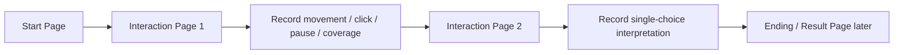
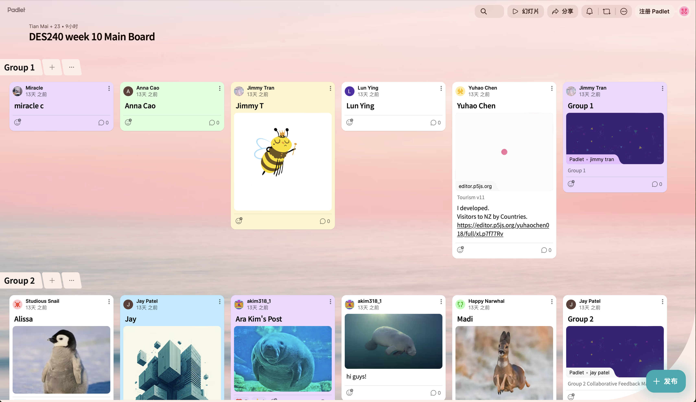
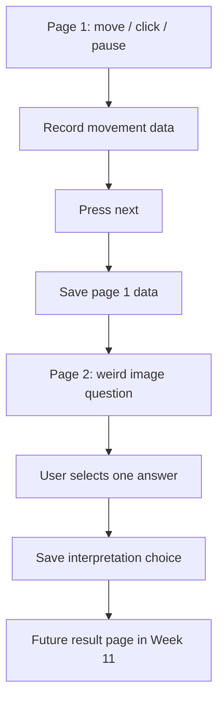
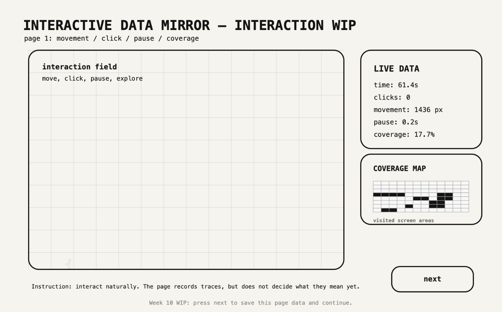
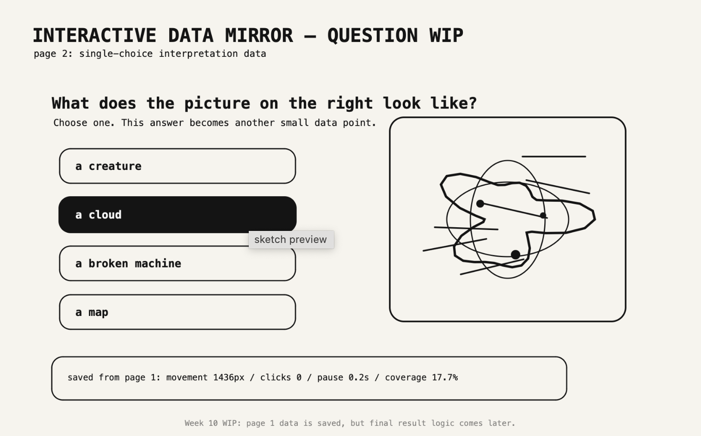
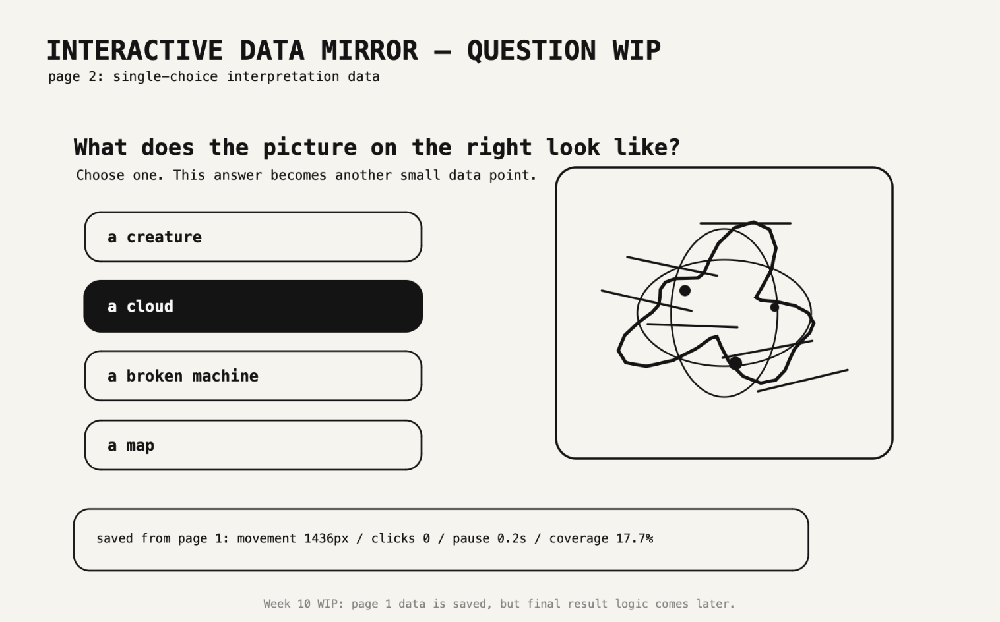
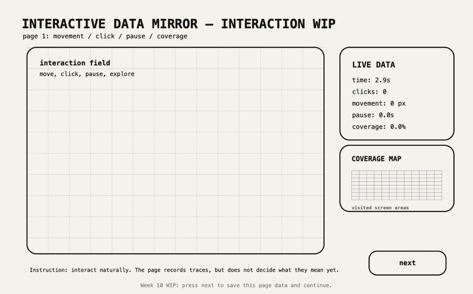

# Week 10 — Progress Report, Action Plan, and Interaction Page Development

[← Back to Home](../index.md)


# Interactive Data Mirror: Developing the Interaction Page

## Overview

Week 10 focused on improving the **interaction page** of *Interactive Data Mirror*. The final artefact is still not complete, because the full start → interaction → result flow will be connected in Week 11. This week was about making the middle part of the website more useful and clearer as a data-collection experience.

In Week 08, I developed the starting page. In Week 09, I developed the ending/result page with possible MBTI-like categories. In Week 10, I worked on the interaction section itself. The interaction page is where the audience creates the behaviour data that the system will later interpret.

After reviewing the first interaction-page prototype, I made one important change: the button on the bottom-right corner now says **“next”** instead of “future result page.” Pressing this button moves the audience to a second interaction page. This second page asks a simple single-choice question based on a weird abstract image. The system records the data from the first page before moving forward.

This is still not the final result system. The Week 10 prototype only tests the interaction sequence and data recording logic. The final interpretation and result generation will be developed in Week 11.

---

# Week 10 Checklist

| Required area | How I addressed it this week | Status |
| --- | --- | --- |
| Progress Reports | Prepared a summary of current project direction and interaction-page progress | Completed |
| Gallery Walk | Briefly documented absence and left space for board documentation | Briefly documented |
| Action Plan | Made a focused plan for Week 11 final integration | Completed |
| Project Development | Built a WIP p5.js interaction page with a second question page | In progress |
| Final artefact | Not final yet; final integration reserved for Week 11 | Not complete |

---

# In-Class Activities

## 1. Progress Report

This week’s progress report focused on the current structure of the website. Instead of presenting the project as one finished system, I explained it as a sequence of connected stages:

| Website stage | Week developed | Current status | Purpose |
| --- | --- | --- | --- |
| Starting page | Week 08 | WIP built | Introduces the project and behaviour traces |
| Interaction page 1 | Week 10 | WIP built | Records movement, clicks, pause time, and coverage |
| Interaction page 2 | Week 10 | WIP built | Records a simple interpretation choice |
| Ending/result page | Week 09 | WIP built | Shows a possible system reading and reflection prompt |
| Final integration | Week 11 | Not finished | Connects all pages into one complete experience |

The progress report helped me identify that the interaction section needed more than one step. The first page records passive behaviour traces, while the second page records an active choice. This makes the dataset more layered.

### Current Project Flow



### What I Presented

| Area | Summary |
| --- | --- |
| Concept | A website that turns audience behaviour into a partial identity reading |
| Data source | Live interaction data created by the audience |
| Week 10 focus | Making the interaction part more complete |
| New decision | Add a “next” button and a second question page |
| Technical direction | p5.js movement trace, coverage map, click tracking, pause tracking, single-choice selection |
| Critical direction | Show that the system collects both behaviour traces and subjective choices |
| Next step | Connect interaction data to result categories in Week 11 |

### Feedback / Self-Assessment Summary

| Strength | Issue | Response |
| --- | --- | --- |
| The project now has a clearer website sequence | The interaction still needs to connect to the final result | Save page 1 data and page 2 answer for Week 11 logic |
| The live data panel makes data capture visible | It may feel too technical if overused | Keep the panel simple and readable |
| The second page adds more audience intention | The question must not feel random | Use a weird image that invites interpretation |
| The “next” button makes the flow clearer | It still needs a final result page connection | Connect to Week 09 result system later |
| The project’s critical idea is clearer | The meaning of behaviour is still ambiguous | Treat ambiguity as part of the system’s limitation |

---

## 2. Gallery Walk

I was unable to attend the Gallery Walk in person. 

  

### Gallery Walk Reflection

Although I did not directly participate in the live Gallery Walk, the activity requirements still reminded me that the project needs to communicate clearly to an audience without verbal explanation. This is important for my final website because it should be self-guided. The audience should understand what to do, when to move forward, and how their action becomes data.

This affected the Week 10 prototype directly. I changed the bottom-right button to **“next”** because it communicates the interaction sequence more clearly. I also added a second page with a direct question, so the audience has a more obvious task after creating movement traces.

---

## 3. Action Plan

The main action point after Week 10 is to connect the interaction data to the ending page in Week 11.

### Action Plan Table

| Priority | Action | Reason | Week 11 outcome |
| --- | --- | --- | --- |
| 1 | Connect start page → interaction page 1 → question page → result page | The project needs a complete website flow | Full experience sequence |
| 2 | Save page 1 behaviour data before moving to next page | The result should be based on collected traces | Data object ready for interpretation |
| 3 | Save page 2 single-choice answer | Adds a subjective interpretation layer | Choice data can affect category |
| 4 | Use interaction data to influence result category | Avoid random MBTI-like result | Data-driven result logic |
| 5 | Make the result visibly partial | Prevents the work from feeling like a real diagnosis | Critical reflection remains clear |
| 6 | Record final screenshots / GIF | Need visual evidence for journal | Final documentation |

### Week 11 Integration Plan

```text
Start page             ███████░░░  needs polish
Interaction page 1     ██████░░░░  movement/click/pause working
Question page          █████░░░░░  single choice working
Result page            ██████░░░░  needs real data input
Data-to-result logic    ██░░░░░░░░  needs Week 11 connection
Documentation          ███████░░░  needs final screenshots/GIF
```

The most important task is not adding more pages. It is making the existing pages work together as one coherent data experience.

---

# Independent Study

## 1. Project Development — Interaction Page

### Why I Focused on the Interaction Page

After building the starting page and ending page in previous weeks, I needed to make the middle section more meaningful. This is where the audience actually creates data. Without this stage, the final result would feel disconnected from the audience’s behaviour.

The first interaction page records passive behavioural traces: movement, clicks, pauses, and coverage. These traces show how the audience behaves while exploring the interface. However, I realised that this was not enough. If the system only records movement, the result may feel too hidden or too automatic.

To make the interaction more explicit, I added a second page with a single-choice question. The question asks the audience what a weird abstract image looks like. This creates a more intentional data point. It shows not only how the audience moves, but also how they interpret an ambiguous visual prompt.

### Interaction Page Goals

| Goal | Design response |
| --- | --- |
| Make audience movement visible | Draw a fading movement trail |
| Show screen coverage | Add a small coverage grid |
| Track direct actions | Count clicks and show pulse marks |
| Track stillness | Display pause time in a data panel |
| Add intentional choice | Add a second page with a single-choice question |
| Keep it WIP | Do not generate final result yet |
| Make flow clearer | Use a bottom-right “next” button |

### Interaction Data Structure

| Data field | Captured on | How it is captured | Possible later use |
| --- | --- | --- | --- |
| `movementDistance` | Page 1 | Distance between current and previous mouse positions | Energy / activity |
| `clickCount` | Page 1 | Increases on mouse press | Action / decision points |
| `pauseTime` | Page 1 | Adds time when movement is very low | Reflection / hesitation |
| `visitedCells` | Page 1 | Grid cells touched by cursor | Exploration / coverage |
| `sessionTime` | Page 1 | Time since entering page | Engagement duration |
| `tracePoints` | Page 1 | Stored cursor positions | Visual movement history |
| `imageChoice` | Page 2 | Single-choice answer | Subjective interpretation / imagination |

### Data Capture Flow



This helped me understand the interaction system as two connected data layers: behavioural traces and interpretive choice.

---

## 2. Interaction Design Choices

### Page 1: Behaviour Trace Page

The first page is designed as a live behaviour capture space. The audience moves inside the interaction field, and the system gradually shows traces of their movement.

| Design element | Current decision | Reason |
| --- | --- | --- |
| Large interaction field | Main space for movement and trace creation | Makes the task obvious |
| Fading trail dots | Shows movement as trace | Makes behaviour visible |
| Click rings | Marks moments of action | Turns clicks into visible data |
| Coverage grid | Shows explored areas | Makes movement measurable |
| Live data panel | Shows what the system is recording | Supports transparency |
| “next” button | Moves to the next stage | Makes the flow clearer |

 

### Page 2: Weird Image Question

The second page shows a strange abstract image on the right and asks a simple single-choice question:

> **What does this image look like?**

The answer options are deliberately open-ended:

| Option | Possible interpretation |
| --- | --- |
| A creature | User sees living form / character |
| A cloud | User sees atmosphere / softness |
| A broken machine | User sees structure / tension |
| A map | User sees path / system |

This question is not meant to be scientifically meaningful. It adds another layer of subjective data. The audience is interpreting an ambiguous image, while the system records that interpretation.

 
 

### Why the Image Is Weird

The image is intentionally weird and unclear because I want the audience to project meaning onto it. If the image is too obvious, the choice becomes too simple. If it is ambiguous, the answer becomes more personal and interpretive.

| Image quality | Intended effect |
| --- | --- |
| Abstract shape | Invites projection |
| Strange outline | Makes interpretation uncertain |
| Mixed organic/mechanical form | Supports multiple readings |
| Not too detailed | Keeps it from becoming a normal illustration |

---

## 3. Technical Development

This week’s p5.js code focused on adding a second interaction page and saving the first page’s data before moving forward.

### Features Built This Week

| Feature | Built? | Notes |
| --- | --- | --- |
| Movement trail | Yes | Fading dots follow cursor |
| Click rings | Yes | Rings appear when clicked |
| Pause tracking | Yes | Counts stillness time |
| Movement distance | Yes | Calculates total movement |
| Coverage grid | Yes | Records explored screen cells |
| Next button | Yes | Moves to the question page |
| Data snapshot | Yes | Saves page 1 data when next is pressed |
| Weird image prompt | Yes | Abstract image on the right |
| Single-choice answers | Yes | Records selected answer |
| Final result generation | No | Reserved for Week 11 |

### Code Example — Changing Button to Next

```javascript
text("next", nextButton.x + nextButton.w / 2, nextButton.y + nextButton.h / 2);
```

This small change improves the usability of the prototype. “Future result page” sounded like a development note, while “next” sounds like an actual interface button.

### Code Example — Saving Page 1 Data

```javascript
pageOneData = {
  movementDistance: floor(movementDistance),
  clickCount: clickCount,
  pauseTime: pauseTime / 1000,
  coverage: coveragePercent
};
```

This is important because the system needs to remember what happened on the first interaction page. The data is not interpreted yet, but it is stored so that Week 11 can use it.

### Code Example — Switching Pages

```javascript
if (screenState === "tracePage" && overButton(nextButton)) {
  savePageOneData();
  screenState = "questionPage";
}
```

This creates a clearer multi-step website structure.

### Code Example — Recording Single Choice

```javascript
selectedChoice = options[i];
```

The selected answer becomes another data point. Later, this could influence the final category or reflection text.

---

## 4. Graphs and Development Tables

### Current Data Readiness

| Data type | Capture status | Confidence | Notes |
| --- | --- | --- | --- |
| Movement distance | Working | High | Easy to calculate |
| Click count | Working | High | Simple and stable |
| Pause time | Working | Medium | Meaning is ambiguous |
| Coverage | Working | High | Visually clear |
| Single-choice interpretation | Working | Medium | Useful but still experimental |
| Path rhythm | Partial | Low | Needs more development |
| Data-to-result logic | Not yet | Low | Week 11 task |

### Interaction Page Development Graph

```text
Movement trace            ████████░░  80%
Click tracking            ████████░░  80%
Coverage map              ███████░░░  70%
Pause tracking            ██████░░░░  60%
Next-page flow            ██████░░░░  60%
Single-choice question    █████░░░░░  50%
Result connection         ██░░░░░░░░  20%
Visual polish             ██░░░░░░░░  20%
```

### Behaviour Data vs Choice Data

| Data type | Example | What it shows | Limitation |
| --- | --- | --- | --- |
| Behaviour data | Movement distance, pause time | How the audience interacted | Cannot explain why |
| Choice data | “The image looks like a map” | How the audience interpreted a prompt | Still shaped by the options given |
| Combined data | Movement + answer | More layered interaction profile | Still partial and designed |

### Design Risk Matrix

| Risk | Impact | Likelihood | Response |
| --- | --- | --- |
| Interaction feels pointless | High | Medium | Add second page with a clear question |
| Question feels random | Medium | Medium | Connect weird image to interpretation and ambiguity |
| Data feels too technical | Medium | Medium | Use simple labels and visible traces |
| Audience tries to “game” the system | Medium | Low | Avoid score-like wording |
| Final category feels random | High | Medium | Use both page 1 and page 2 data in Week 11 |

---

# Week 10 Reflection

Week 10 helped me turn the interaction section from a single data capture screen into a clearer multi-step experience. The first version of the interaction page recorded movement, clicks, pause time, and coverage. This was useful, but the page still felt like a technical test rather than a complete audience interaction. Changing the bottom-right button to **“next”** and adding a second question page made the prototype feel more like a website journey.

The second page also helped me expand the data source. The project is not only about passive behaviour, such as how someone moves or pauses. It can also include subjective interpretation, such as what the audience sees in an ambiguous image. This fits the project because the final system is about how data becomes a partial identity reading. The weird image question creates a small moment where the audience’s interpretation becomes another data point.

The main technical development this week was saving a snapshot of the first page’s data before moving to the second page. This is important because Week 11 will need to connect behaviour data to the result categories. At this stage, the data is collected and stored, but it is not yet fully interpreted.

The critical challenge remains the same: the system can record behaviour and choices, but it cannot fully know what those actions mean. A pause could be reflection, confusion, or distraction. A choice could be shaped by the wording of the options. This uncertainty is not a weakness to hide; it is part of the project’s meaning.

For Week 11, my main task is to connect the collected interaction data to the ending/result page and make the final website flow complete.

---

# Week 10 p5.js Prototype

[Week 10 Interaction Page Prototype — paste your live p5.js / GitHub Pages link here](https://editor.p5js.org/Jeffcai0502/sketches/KbHLebwDJ)

  
*Week 10 progress GIF. The prototype now includes the first interaction page, a next button, stored page-one data, and a second page with a weird image single-choice question. The final result logic will be connected in Week 11.*

---

# Short Caption for Website Link

The Week 10 prototype develops the interaction section of **Interactive Data Mirror**. The first page records movement, clicks, pause time, and coverage. Pressing **next** stores this data and opens a second page with a weird abstract image and a single-choice question. The prototype tests how behaviour data and subjective choice data might be combined later in the final result.

---

# AI Acknowledgement

I used ChatGPT to help structure this Week 10 journal entry, revise the interaction-page development, organise the action plan, and support the p5.js multi-page prototype. I edited the content to match my project direction and used AI as part of my documented design workflow.
