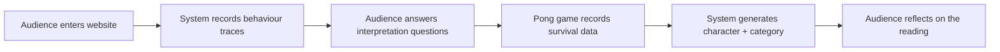
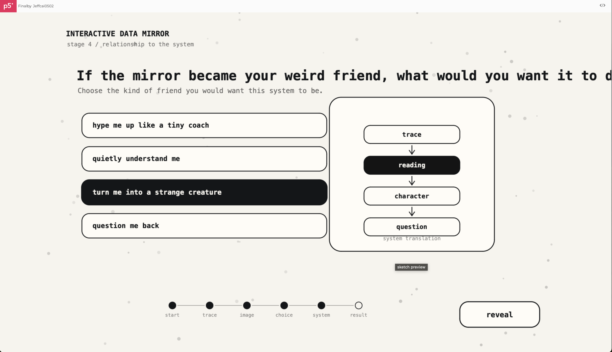
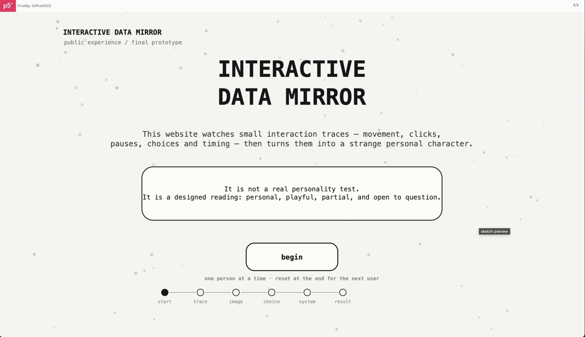
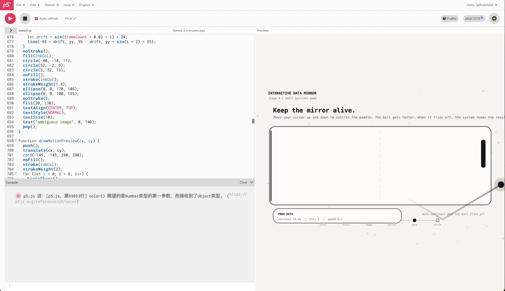

# Week 11 — Journal Review, Practice Consultation, and Project Finalisation

[← Back to Home](../index.md)

# Interactive Data Mirror: Final Website Experience

## Overview

Week 11 focused on finalising **Interactive Data Mirror** into a complete web-based interactive data visualisation. In the previous weeks, I developed the project in separate parts: the starting page in Week 08, the ending/result page in Week 09, and the main interaction page in Week 10. This week, I connected these parts into one full experience and refined the user journey.

The final work is a website that asks the audience to interact with a digital system. It records small behaviour traces such as movement, clicks, pause time, screen coverage, interpretation choices, and a short survival game. These traces are then translated into a personalised “weird moving character,” a category, and a special name.

The project does not claim to accurately measure emotion or personality. Instead, it presents a designed reading of the audience based on limited data. The final result is intentionally playful and strange, but it also asks a critical question:

> Is this really me, or a version of me created by data?

This week was mostly about fixing errors, improving the flow, making the interface more suitable for a public showcase, and making the final user experience clear enough for someone to complete without verbal explanation.

---

# Week 11 Checklist

| Required area | How I addressed it this week | Status |
| --- | --- | --- |
| Journal Review | Reviewed the project development across Weeks 06–10 and checked that the final week connects to earlier decisions | Completed |
| Practice Consultations | Used testing and small feedback moments to refine usability, wording, and interaction sequence | Completed |
| Showcase Planning | Adjusted the experience for a MacBook Air 13-inch full-screen display and one-user-at-a-time interaction | Completed |
| Project Finalisation | Combined start, interaction, questions, Pong game, and result page into one complete p5.js website | Completed |
| Final documentation | Prepared GIF/link placeholders and recorded final design decisions | Completed |

---

# 1. Journal Review

Before finalising the project, I reviewed the development from the previous weeks. This helped me check whether the final website still matched the original project intention.

| Week | Development focus | What carried into the final |
| --- | --- | --- |
| Week 06 | Research, planning, simple live data capture | Behaviour data as the main data source |
| Week 07 | Concept sketches, making sprint, “what if” variations | The idea that the audience should question the system’s reading |
| Week 08 | Starting page development | Clear entry page explaining the data mirror |
| Week 09 | Ending/result page development | MBTI-like categories, special result names, reflection question |
| Week 10 | Interaction page development | Movement traces, click data, pause time, coverage, image question |
| Week 11 | Final integration | Complete start-to-result user experience |

This review showed that the final project is not just a technical sketch. It has a clear conceptual structure:



The project has also remained consistent with the original critical idea. It still focuses on how digital systems interpret people through small behavioural traces, while making the limits of that interpretation visible.

---

# 2. Practice Consultation / Final Testing Notes

During final testing, I focused less on adding new content and more on making the experience usable. Because this work is intended to be viewed by a public audience, the interface needed to be self-explanatory.

The main issues I noticed during testing were:

| Issue | Why it mattered | Final response |
| --- | --- | --- |
| The system question felt too abstract | It did not feel connected enough to the audience’s body or behaviour | Replaced it with a short Pong survival game |
| The progress bar was not centred | It made the interface feel slightly unfinished | Re-centred the progress bar mathematically |
| The experience needed a clear reset | Showcase users need to take turns | Added a “start again” button on the final page |
| Full-screen display needed improvement | The project should fit a 13-inch MacBook Air screen | Made the canvas responsive/full-screen |
| Some wording sounded too technical | The project needed to feel more engaging | Rewrote parts of the interface to feel more direct and playful |

The most important consultation/testing insight was that the final experience needed more active user engagement before the result. The previous question, “What should a system do with your data?”, supported the concept but felt too text-based. Replacing it with a Pong game made the interaction more embodied and memorable.

---

# 3. Showcase Planning

For the final showcase, I planned the experience as a **one-user-at-a-time website interaction**. Each participant can complete the experience, receive their generated character, then press **start again** so the next person can use it.

### Showcase Setup Plan

| Element | Plan |
| --- | --- |
| Device | MacBook Air 13-inch |
| Display | Full-screen browser or p5.js preview |
| Interaction | Mouse/trackpad movement and clicking |
| Audience flow | One participant completes the experience, then resets for the next |
| Documentation | Record a GIF of the full flow and link to the live website |
| Support material | Brief wall text / project statement beside the device |

### Final User Flow

```text
Start page
↓
Movement trace page
↓
Ambiguous image question
↓
Movement tendency question
↓
Pong survival game
↓
Generated character / category / special name
↓
Start again
```

The showcase version should be clear enough that the audience can use it without me explaining every step. At the same time, the language on the website still reminds users that the result is not a scientific truth.

---

# 4. Project Finalisation

## 4.1 Three Final Development Screenshots

  
*Figure 1. Earlier version of the final interaction flow. This screen still used a text-based system question, which felt too abstract and was later replaced.*

  
*Figure 2. Final start page after refining the layout for a MacBook Air 13-inch full-screen display.*

  
*Figure 3. Pong survival stage. This replaced the previous system question and records survival time, paddle hits, and maximum ball speed.*

---

## 4.2 Final Website Structure

The final website is built as a single p5.js sketch with multiple screen states. This allowed me to create a complete journey while keeping all interaction data inside one system.

| Screen state | Audience action | Data recorded |
| --- | --- | --- |
| `start` | Reads introduction and begins | No data yet |
| `trace` | Moves, clicks, pauses, explores | movement distance, clicks, pause time, coverage |
| `imageQuestion` | Interprets a weird image | subjective image choice |
| `motionQuestion` | Chooses a movement/decision tendency | self-reading choice |
| `pongGame` | Controls paddle until ball flies off | survival time, hits, max speed |
| `result` | Receives generated character | final category, special name, reflection |

### Why This Structure Works

The final experience now combines three kinds of data:

| Data type | Example | Why it matters |
| --- | --- | --- |
| Behaviour data | movement, clicks, pauses, coverage | Shows how the audience physically interacts with the website |
| Interpretation data | what the weird image looks like | Shows how the audience makes meaning from ambiguity |
| Performance data | Pong survival time and hits | Adds pressure, reaction, and adaptation |

This makes the final result feel more layered than a normal personality quiz. The system is not only asking the user to choose answers. It also watches how they move and how they respond under a simple time-based interaction.

---

# 5. Error Fixing and Technical Refinement

## 5.1 Full-Screen Scaling Error

One of the main technical issues this week happened when I changed the sketch to full-screen mode. The earlier code used a fixed `createCanvas(1000, 640)`. This worked for screenshots, but it did not properly fill a MacBook Air display.

I changed the canvas to:

```javascript
createCanvas(windowWidth, windowHeight);
```

However, this created a coordinate problem. The visual design was still based on a 1000 × 640 layout, but the real browser window had a different size. To fix this, I added a responsive scaling system:

```javascript
function updateResponsiveLayout() {
  scaleFactor = min(width / W, height / H);
  offsetX = (width - W * scaleFactor) / 2;
  offsetY = (height - H * scaleFactor) / 2;
}

function sx(x) {
  return (x - offsetX) / scaleFactor;
}

function sy(y) {
  return (y - offsetY) / scaleFactor;
}
```

This allows the visual layout to stay proportional while still filling the screen. It also keeps mouse interaction accurate after scaling.

### What I Learned

This fix showed me that full-screen interaction is not only a visual issue. If the canvas is scaled, mouse input also needs to be translated into the same coordinate system as the interface. Otherwise, buttons and interaction areas become inaccurate.

---

## 5.2 Progress Bar Alignment

Another small but important design issue was the progress bar at the bottom. It was slightly off-centre, which made the final interface look less polished. I fixed it by calculating the starting point based on the number of steps and the spacing between them.

```javascript
let labels = ["start", "trace", "image", "choice", "pong", "result"];
let gap = 92;
let x = W / 2 - ((labels.length - 1) * gap) / 2;
```

This means the progress bar is now centred mathematically rather than placed manually. This small change made the interface feel more finished.

---

## 5.3 Replacing the System Question with Pong

The earlier version had a question:

> If the mirror became your weird friend, what would you want it to do?

This was more fun than the previous system-data question, but it still felt too text-heavy. For the final version, I replaced this screen completely with a simple Pong-style survival game.

### Why Pong Works Better

| Previous system question | Final Pong stage |
| --- | --- |
| Text-based | Action-based |
| Records preference only | Records performance and adaptation |
| Feels abstract | Feels embodied and immediate |
| Slows the experience down | Adds energy before the result |
| Less memorable | More playful and interactive |

The Pong stage records:

- how long the user survives
- how many paddle hits they make
- the maximum ball speed reached

The ball becomes faster over time and after each successful hit. When the ball flies off the screen, the system automatically moves to the result page. This creates a more natural transition because the interaction ends when the system “breaks” or escapes.

---

# 6. Final Category and Character System

The final result uses the collected data to create a strange moving character. The character is not random. It is generated from six internal dimensions:

| Dimension | Informed by |
| --- | --- |
| **Energy** | movement distance, clicks, Pong speed |
| **Reflection** | pause time, first click delay, some choices |
| **Exploration** | screen coverage, movement distance, choices |
| **Clarity** | directness, Pong hits, some choices |
| **Imagination** | weird image interpretation and character-related choices |
| **Tension** | clicks, pause ratio, Pong speed, uncertainty |

These dimensions are then translated into one of eight possible categories:

| Category | General meaning |
| --- | --- |
| **Spark Explorer** | active, fast, possibility-seeking |
| **Quiet Observer** | slow, careful, internally attentive |
| **Deep Drifter** | nonlinear, searching, layered |
| **Clear Navigator** | direct, stable, decision-oriented |
| **Tension Keeper** | active outside, compressed inside |
| **Soft Shifter** | mixed, adaptive, unresolved |
| **Signal Creature** | strange, imaginative, responsive |
| **Hidden Architect** | careful, structured, quietly analytical |

The system also generates a special name, such as **The Electric Comet**, **The Silent Oracle**, or **The Mythic Familiar**. This gives the audience a memorable takeaway while still keeping the result strange and speculative.

### Important Critical Position

The final page clearly states that the result is not a truth about the person. It is a designed translation of limited traces. This is important because the project is not trying to make a scientific personality system. It is showing how easily systems can turn partial data into identity-like outputs.

---

# 7. Final Design Decisions

| Design decision | Reason |
| --- | --- |
| Monochrome/off-white visual style | Keeps the interface clean, system-like, and connected to earlier sketch diagrams |
| Moving background particles | Suggests invisible data traces moving around the user |
| Full-screen responsive layout | Makes the work feel more like a complete public experience |
| Progress bar | Helps users understand where they are in the journey |
| Pong game | Adds embodied interaction and creates new performance data |
| Weird moving character | Makes the data output memorable and personal |
| “Start again” button | Allows the next showcase user to take over easily |
| Reflection question | Keeps the critical meaning visible |

The final project now feels more complete because it has both playful interaction and critical framing. The audience gets a personal result, but the website also asks them to question how that result was produced.

---

# 8. Final p5.js Website

[Final Interactive Data Mirror Website](https://editor.p5js.org/Jeffcai0502/full/vkvgoq-qx)
[Code](https://editor.p5js.org/Jeffcai0502/sketches/vkvgoq-qx)

  
*Final GIF. The completed experience moves from the start page, through behaviour capture, interpretation questions, Pong survival, and final generated character/category result.*

---

# 9. Final Reflection

Week 11 brought the project from separate prototype pages into a complete interactive experience. The main challenge was not only writing more code, but deciding what kind of experience would best communicate the project’s meaning. Earlier versions were technically functional, but some parts felt too abstract or too text-heavy. The biggest improvement was replacing the final system question with a Pong survival stage. This made the project more active and gave the system another form of data to interpret.

The full-screen scaling fix was also important. A final public website needs to feel intentional on the display it is shown on. By creating a responsive layout and correcting the mouse coordinates, the final sketch became more suitable for a showcase setting.

Conceptually, the project now has a stronger relationship between input and output. The audience first creates behaviour data through movement, clicks, pauses, and coverage. Then they provide interpretation data through choices. Then they create performance data through the Pong game. These layers are combined into a generated moving character, category, and special name.

The final work still keeps the critical point clear: data can create a convincing version of a person, but that version is always incomplete. The system can record behaviour, but it cannot fully understand context, emotion, culture, or intention. This gap between data and personhood is the core of **Interactive Data Mirror**.

---

# AI Acknowledgement

I used ChatGPT to help structure this Week 11 journal entry, refine the explanation of code errors and design decisions, and support the final p5.js development process. I edited the content to match my own project direction and used AI as part of my documented design workflow.
