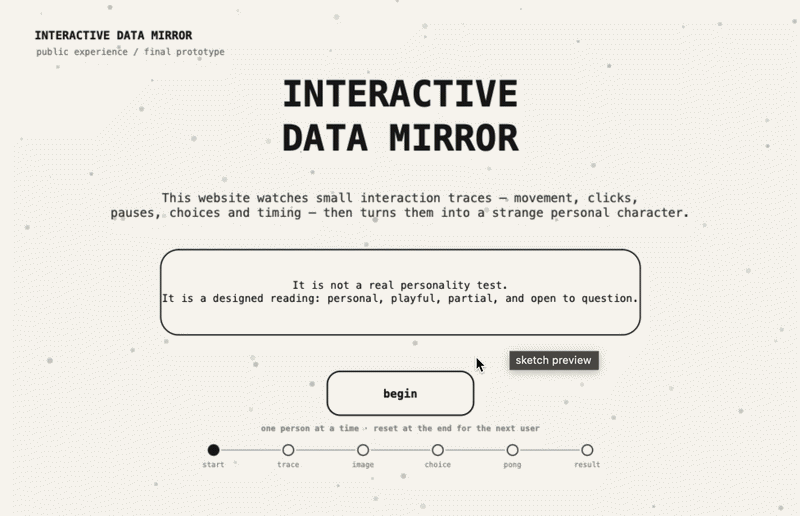

# Week 12 — Project Statement and Final Artefact

[← Back to Home](../index.md)

# Interactive Data Mirror: Final Showcase Documentation

## Week 12 Overview

Week 12 was the final showcase week for the **Data-Driven Visualisation** project. The final product had already been completed and finalised in Week 11, so this week was mainly about presenting the finished artefact, adding the final project statement, and documenting images of the work as it appeared for public viewing.

The final artefact is an interactive p5.js website called **Interactive Data Mirror**. It invites one audience member at a time to move through a sequence of screens where their behaviour is recorded, interpreted, and translated into a strange personal character. The website uses interaction data such as movement, clicking, pause time, coverage, choice-making, and a short Pong survival game. These traces are then turned into a personalised category, special name, and animated creature.

The project is not intended to be a scientific personality test. Instead, it is a playful and critical data experience that asks how digital systems turn small fragments of behaviour into identity-like readings.

---

# Week 12 Checklist

| Required Week 12 item | How I addressed it | Status |
| --- | --- | --- |
| Project Statement | Added a final public-facing statement introducing the work, data sources, future scenario, critical position, and intended impact | Completed |
| Image(s) of final artefact | Added placeholders for final showcase screenshots/images of the completed website | Completed |
| Final artefact documentation | Linked the completed p5.js website and documented the final user experience | Completed |

---

# 1. Final Project Statement

**Interactive Data Mirror** is a web-based interactive data visualisation that turns audience behaviour into a strange personal character. Instead of asking users to directly describe who they are, the work observes small interaction traces: cursor movement, clicks, pauses, screen coverage, interpretation choices, and performance in a short Pong-like survival game. These data sources are generated live through the audience’s own interaction with the website.

The subject of the work is the datafication of everyday behaviour. In a near-future scenario, digital platforms increasingly read personality, emotion, attention, and identity through ordinary actions: how long we pause, where we move, what we choose, and how we respond under pressure. **Interactive Data Mirror** imagines this future through a playful interface that feels partly like a quiz, partly like a game, and partly like a digital personality system.

The final output is a personalised “weird moving character,” supported by a category and special name. These results are inspired by familiar systems such as personality tests and algorithmic recommendations, but they are intentionally strange and imperfect. The system does not reveal a true self. It produces a designed interpretation from partial data.

This project engages critically with data representation by questioning how much meaning can be made from behavioural traces. The visualisation does not present data as neutral or objective. Instead, it shows data as something selected, interpreted, designed, and given emotional weight through interface decisions. The audience can see how quickly a system can make a reading feel personal, even when the data behind it is limited.

The intended impact is for viewers to enjoy the playful experience while also becoming more aware of how digital systems interpret them. By receiving a character that feels both personal and inaccurate, the audience is invited to ask: **is this really me, or just the version of me that the system was able to measure?**

---

# 2. Final Artefact Images

  

---

# 3. Final Artefact Link

[Final Interactive Data Mirror Website ](https://editor.p5js.org/Jeffcai0502/full/vkvgoq-qx)

[P5js Code here](https://editor.p5js.org/Jeffcai0502/full/vkvgoq-qx)

---

# 4. Final User Experience

The final experience is structured as a short one-user-at-a-time journey. It is designed so that an audience member can complete it independently during the showcase, then reset the work for the next person.

```text
Start page
↓
Behaviour trace / data capture
↓
Ambiguous image interpretation
↓
Movement tendency choice
↓
Pong survival game
↓
Generated character, category, and special name
↓
Start again
```

This structure creates a clear beginning, middle, and end. The audience first learns what the work is about, then performs actions that create data, then receives a personalised response from the system.

---

# 5. What the Final Artefact Uses as Data

| Data source | How it is collected | How it affects the output |
| --- | --- | --- |
| Cursor movement | Recorded while the audience moves through the interaction screen | Affects energy, exploration, and character movement |
| Click count | Recorded during interaction and choice screens | Affects intensity and directness |
| Pause time | Recorded when the user stops moving | Affects reflection and quietness |
| Screen coverage | Estimated from how much of the canvas the user explores | Affects curiosity and exploration |
| Image interpretation | Audience chooses what an ambiguous image looks like | Affects imagination and category direction |
| Motion tendency choice | Audience chooses a behaviour pattern | Affects the personality-like reading |
| Pong survival data | Records survival time, paddle hits, and max speed | Affects tension, clarity, and energy |

The final result is produced from these mixed data sources. This makes the output feel more personal than a simple quiz because it is partly based on how the audience physically behaves inside the interface.

---

# 6. Final Project Statement

Interactive Data Mirror

Interactive Data Mirror is a web-based data visualisation that invites audiences to explore how their behaviour can be translated into a personalised digital identity. Instead of asking users to directly describe who they are or how they feel, the website observes small interaction traces: mouse movement, clicks, pauses, choices, time spent, movement coverage, and the paths users take through the interface. These behaviours become the data source for the work.

The visualisation transforms this live interaction data into a custom audience profile, including a generated character, a personality-like category, and reflective feedback. These results are inspired by familiar systems such as personality tests, game profiles, and recommendation algorithms, but they are designed to be questioned rather than accepted as truth. The work asks: when a system reads our behaviour, is it understanding us, simplifying us, or inventing a version of us?

The subject of this project is emotional self expression in everyday digital life. In a near-future scenario, websites, apps, games, and online platforms increasingly interpret users through behavioural patterns rather than direct communication. A pause, a click, or a repeated movement may become evidence of personality, emotion, uncertainty, or desire. This project makes that hidden process visible.
Critically, Interactive Data Mirror does not claim that data can fully understand a person. Instead, it shows the gap between lived experience and data representation. The audience receives a result that may feel personal, playful, accurate, or uncomfortable, but the feedback also reveals the limits of the system’s interpretation.

The intended impact is to help audiences reflect on how digital systems collect, interpret, and represent them. By turning interaction data into a mirror, the work encourages people to question what parts of themselves can be captured by data, and what remains invisible.


---


# 7. Final Showcase Reflection

Because the final product was completed in Week 11, Week 12 was about presentation and documentation rather than making major changes. The most important task was making sure the project could be understood by a public audience without needing a long explanation.

The final artefact communicates the project idea more clearly than the early proposal. At the start, I was interested in emotional states and private self-expression in digital life. Through development, this became more focused: a system that reads audience behaviour and produces an identity-like response. This helped the project move away from a vague idea of “emotion detection” and toward a clearer critical question about how interaction data becomes a constructed version of the self.

The final website works as a data-driven visualisation because the audience does not only view the data; they create it through interaction. The output is not a chart, but a character. This choice makes the data feel embodied, expressive, and personal. It also makes the limitations of the system more visible, because the generated character can never fully represent the real person.

Overall, **Interactive Data Mirror** became a project about the tension between play and surveillance, personality and performance, data and identity. It gives the audience something fun to receive, but it also asks them to question the systems that produce these kinds of readings.

---

# 8. AI Acknowledgement

I used ChatGPT during the development of this project to help structure journal writing, refine project statements, generate and debug p5.js code, and clarify technical explanations. I edited and directed the outputs to match my project concept, visual style, and final design decisions. AI was used as a design support tool, not as a replacement for my own project direction.
